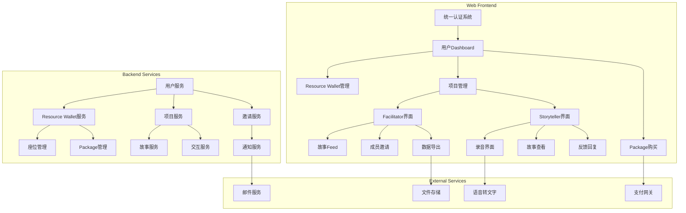
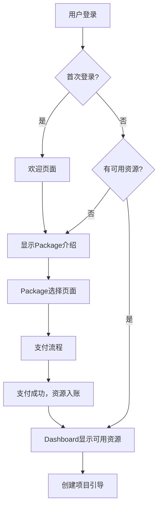
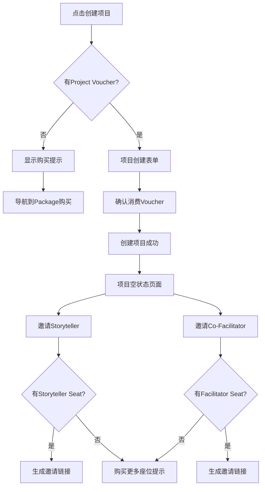
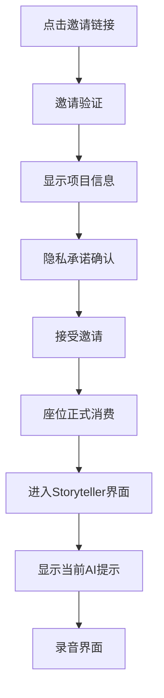

# MVP页面流程对齐设计文档

## 概述

本设计文档详细说明如何重构当前系统以符合MVP需求文档的规范，重点解决Resource Wallet系统、Package购买流程、页面导航关系等核心架构问题。所有功能将作为响应式Web应用实现。

## 架构设计

### 系统架构重构



### 数据模型设计

#### Resource Wallet模型
```typescript
interface ResourceWallet {
  userId: string;
  projectVouchers: number;
  facilitatorSeats: number;
  storytellerSeats: number;
  updatedAt: Date;
}

interface SeatTransaction {
  id: string;
  userId: string;
  transactionType: 'purchase' | 'consume' | 'refund';
  resourceType: 'project_voucher' | 'facilitator_seat' | 'storyteller_seat';
  amount: number; // 正数为增加，负数为消费
  projectId?: string;
  invitationId?: string;
  createdAt: Date;
}
```

#### Package模型
```typescript
interface Package {
  id: string;
  name: string;
  description: string;
  price: number;
  currency: string;
  resources: {
    projectVouchers: number;
    facilitatorSeats: number;
    storytellerSeats: number;
  };
  subscriptionDuration: number; // 月数
  isActive: boolean;
}
```

#### 邀请模型增强
```typescript
interface Invitation {
  id: string;
  projectId: string;
  invitedBy: string;
  role: 'facilitator' | 'storyteller';
  email?: string;
  token: string;
  status: 'pending' | 'accepted' | 'expired' | 'rejected';
  seatReserved: boolean; // 是否已预留座位
  expiresAt: Date;
  acceptedAt?: Date;
  createdAt: Date;
}
```

## 组件设计

### 1. Resource Wallet组件

#### ResourceWalletSummary组件
```typescript
interface ResourceWalletSummaryProps {
  wallet: ResourceWallet;
  onManageClick: () => void;
}

// 显示格式："可用座位：1个项目，0个Facilitator，1个Storyteller"
// 点击后导航到完整资源管理页面
```

#### ResourceWalletManager组件
```typescript
interface ResourceWalletManagerProps {
  wallet: ResourceWallet;
  transactions: SeatTransaction[];
  onPurchaseMore: (resourceType: string) => void;
}

// 显示详细的资源使用历史和购买选项
```

### 2. Package Purchase组件

#### PackageSelector组件
```typescript
interface PackageSelectorProps {
  packages: Package[];
  selectedPackage?: Package;
  onSelect: (package: Package) => void;
  onPurchase: (package: Package) => void;
}

// 显示可用Package，突出显示推荐选项
// 清楚说明每个Package包含的资源和价值
```

#### PurchaseFlow组件
```typescript
interface PurchaseFlowProps {
  package: Package;
  onSuccess: (transaction: any) => void;
  onCancel: () => void;
}

// 处理支付流程，成功后更新用户Resource Wallet
```

### 3. Dashboard重构

#### UserDashboard组件
```typescript
interface UserDashboardProps {
  user: User;
  wallet: ResourceWallet;
  projects: Project[];
  isFirstTime: boolean;
}

// 根据用户状态显示不同界面：
// - 首次用户：欢迎界面 + 创建Saga CTA
// - 有资源无项目：项目创建引导
// - 有项目：项目列表 + 资源摘要
```

#### ProjectCard组件
```typescript
interface ProjectCardProps {
  project: Project;
  memberCount: number;
  storyCount: number;
  subscriptionStatus: 'active' | 'expiring' | 'archived';
  onEnter: () => void;
  onManage: () => void;
}

// 显示项目概览信息和快速操作
```

### 4. 项目创建流程

#### ProjectCreationWizard组件
```typescript
interface ProjectCreationWizardProps {
  availableVouchers: number;
  onComplete: (project: Project) => void;
  onCancel: () => void;
}

// 步骤：
// 1. 检查Resource Wallet
// 2. 项目基本信息
// 3. 确认消费Voucher
// 4. 创建成功，导航到项目空状态
```

### 5. 邀请系统重构

#### InvitationManager组件
```typescript
interface InvitationManagerProps {
  projectId: string;
  availableSeats: {
    facilitator: number;
    storyteller: number;
  };
  pendingInvitations: Invitation[];
  onSendInvitation: (role: string, email?: string) => void;
  onCancelInvitation: (invitationId: string) => void;
}

// 显示当前邀请状态，管理座位预留和消费
```

### 6. Storyteller专用界面

#### StorytellerDashboard组件
```typescript
interface StorytellerDashboardProps {
  project: Project;
  currentPrompt: Prompt;
  recentStories: Story[];
  pendingFeedback: Interaction[];
}

// 老年人友好设计：
// - 大字体选项
// - 高对比度模式
// - 简化导航
// - 清晰的录音按钮
```

#### WebAudioRecorder组件
```typescript
interface WebAudioRecorderProps {
  onRecordingComplete: (audioBlob: Blob) => void;
  onError: (error: string) => void;
  maxDuration: number; // 10分钟限制
}

// 浏览器录音功能：
// - 权限请求处理
// - 录音状态指示
// - 回放功能
// - 浏览器兼容性检查
```

## 页面流程设计

### 1. 新用户首次登录流程



### 2. 项目创建和邀请流程



### 3. Storyteller接受邀请流程



## 技术实现细节

### 1. Resource Wallet服务

```typescript
class ResourceWalletService {
  async getWallet(userId: string): Promise<ResourceWallet> {
    // 获取用户资源钱包状态
  }
  
  async consumeResource(
    userId: string, 
    resourceType: string, 
    amount: number,
    context?: { projectId?: string, invitationId?: string }
  ): Promise<boolean> {
    // 原子性消费资源，记录交易
  }
  
  async reserveSeat(
    userId: string, 
    seatType: string, 
    invitationId: string
  ): Promise<boolean> {
    // 预留座位，不立即消费
  }
  
  async confirmSeatConsumption(invitationId: string): Promise<void> {
    // 确认消费预留的座位
  }
  
  async releaseSeat(invitationId: string): Promise<void> {
    // 释放预留的座位
  }
}
```

### 2. Package管理服务

```typescript
class PackageService {
  async getAvailablePackages(): Promise<Package[]> {
    // 获取可购买的Package列表
  }
  
  async purchasePackage(
    userId: string, 
    packageId: string, 
    paymentToken: string
  ): Promise<PurchaseResult> {
    // 处理Package购买，更新Resource Wallet
  }
  
  async getAlaCarteOptions(): Promise<AlaCarteOption[]> {
    // 获取单独购买座位的选项
  }
}
```

### 3. 邀请管理服务

```typescript
class InvitationService {
  async createInvitation(
    projectId: string,
    invitedBy: string,
    role: string,
    email?: string
  ): Promise<Invitation> {
    // 创建邀请，预留座位
  }
  
  async acceptInvitation(token: string): Promise<AcceptResult> {
    // 接受邀请，消费座位
  }
  
  async expireInvitation(invitationId: string): Promise<void> {
    // 过期邀请，释放座位
  }
}
```

### 4. Web录音实现

```typescript
class WebAudioRecorder {
  private mediaRecorder: MediaRecorder | null = null;
  private audioChunks: Blob[] = [];
  
  async requestPermission(): Promise<boolean> {
    // 请求麦克风权限
  }
  
  async startRecording(): Promise<void> {
    // 开始录音
  }
  
  async stopRecording(): Promise<Blob> {
    // 停止录音，返回音频数据
  }
  
  checkBrowserSupport(): boolean {
    // 检查浏览器录音支持
  }
}
```

## 无障碍设计

### 老年人友好界面特性

1. **字体和对比度**
   - 提供三种字体大小：标准、大、特大
   - 高对比度模式选项
   - 清晰的视觉层次

2. **交互设计**
   - 大按钮（最小44px点击区域）
   - 简化的导航结构
   - 明确的操作反馈

3. **录音界面优化**
   - 大型录音按钮
   - 清晰的录音状态指示
   - 简单的回放控制

4. **错误处理**
   - 友好的错误信息
   - 清晰的解决方案指导
   - 技术支持联系方式

## 响应式设计

### 断点设计
- 移动端：< 768px
- 平板端：768px - 1024px  
- 桌面端：> 1024px

### 适配策略
1. **移动端优先**：从小屏幕开始设计
2. **触摸友好**：适当的按钮大小和间距
3. **内容优先**：确保核心功能在所有设备上可用
4. **性能优化**：针对移动网络优化加载速度

## 错误处理和边界情况

### 1. 资源不足处理
- 清晰的提示信息
- 直接的购买链接
- 功能禁用状态说明

### 2. 邀请过期处理
- 自动释放预留座位
- 通知邀请发送者
- 提供重新邀请选项

### 3. 浏览器兼容性
- 录音功能降级方案
- 不支持功能的替代方案
- 清晰的技术要求说明

### 4. 网络问题处理
- 离线状态检测
- 自动重试机制
- 数据同步恢复

## 性能考虑

### 1. 加载优化
- 代码分割和懒加载
- 关键路径优化
- 资源预加载

### 2. 录音优化
- 音频压缩
- 分块上传
- 进度显示

### 3. 缓存策略
- 静态资源缓存
- API响应缓存
- 离线数据存储

这个设计文档提供了完整的技术实现方案，确保新系统完全符合MVP需求文档的规范，同时针对纯Web应用的特点进行了优化。