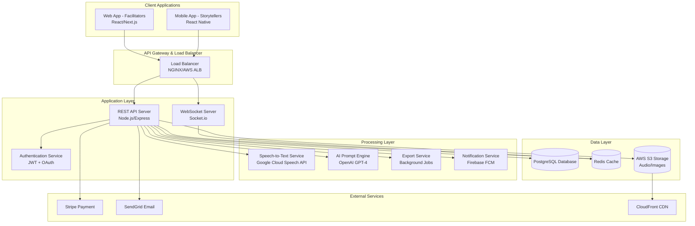
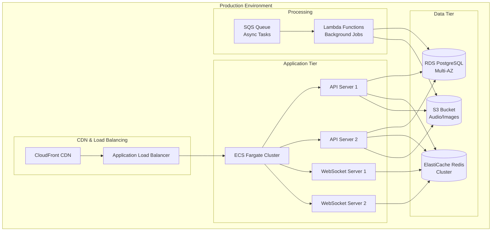

# Design Document

## Overview

Saga is a cross-platform family biography application implementing a flexible package/seat business model that enables family collaboration. The system features a dual-platform approach: **Facilitators** (adult children) use both web and mobile interfaces for project management and story interaction, while **Storytellers** (parents) use an exclusively mobile experience optimized for AI-guided voice recording.

The architecture follows a client-server model with a unified backend API serving both platforms, implementing a sophisticated resource management system for packages and seats, real-time collaboration features, and a robust media processing pipeline with confirmation workflows. Key v1.5 features include multi-facilitator collaboration, recording confirmation steps, chapter-based AI prompts, and automatic archival mode after subscription expiry.

## Architecture

### System Architecture



### Technology Stack

**Backend:**
- **Runtime:** Node.js 18+ with Express.js framework
- **Database:** PostgreSQL 14+ for relational data
- **Cache:** Redis 7+ for sessions and frequently accessed data
- **Storage:** AWS S3 for audio files and images
- **Real-time:** Socket.io for WebSocket connections

**Web Frontend (Facilitators):**
- **Framework:** React 18 with Next.js 13+ (App Router)
- **Styling:** Tailwind CSS with custom design system
- **State Management:** Zustand for client state
- **HTTP Client:** Axios with interceptors for API calls

**Mobile App (Storytellers):**
- **Framework:** React Native 0.72+ with Expo
- **Navigation:** React Navigation 6
- **Audio Recording:** expo-av for audio recording and playback
- **Push Notifications:** Expo Notifications with Firebase

**External Integrations:**
- **Speech-to-Text:** Google Cloud Speech-to-Text API
- **AI Prompts:** OpenAI GPT-4 API
- **Payments:** Stripe for web, Apple Pay/Google Pay for mobile
- **Email:** SendGrid for transactional emails
- **Push Notifications:** Firebase Cloud Messaging

## Client-Side Persistence & Offline Support

To ensure a robust user experience, especially for the Storyteller, the mobile application must handle temporary offline states and recover from interruptions gracefully.

### 1. Draft Storage

- **Technology:** The mobile app will use **MMKV Storage** (or `AsyncStorage` as a fallback) for fast, synchronous, and persistent key-value storage. It is ideal for storing unsent recording drafts.

- **Draft Object:** When a recording is stopped but not yet sent, a draft object will be saved to local storage.

```typescript
interface LocalRecordingDraft {
  sessionId: string      // A unique ID for the draft
  projectId: string      // The project it belongs to
  localAudioUri: string  // The local file URI of the saved audio
  duration: number
  localPhotoUri?: string // The local file URI of the selected photo
  createdAt: Date
}
```

- **Workflow:**
  1. **On App Launch:** The app checks for the existence of a `LocalRecordingDraft`.
  2. **Draft Found:** The UI prompts the user to either "Resume Uploading" or "Delete" the draft.
  3. **Resume:** The app retrieves the local files (audio/photo) and initiates the `confirmAndSend` workflow.
  4. **Success/Delete:** The draft is cleared from local storage.

### 2. Offline Queue (Future Consideration)

While not in MVP, this design anticipates a future need for an offline queue for actions like commenting, which would be stored locally and synced with the server when connectivity is restored.

## Components and Interfaces

### Core Components

#### 1. Authentication Service
```typescript
interface AuthService {
  signUp(email: string, password: string): Promise<AuthResult>
  signIn(email: string, password: string): Promise<AuthResult>
  signInWithOAuth(provider: 'google' | 'apple'): Promise<AuthResult>
  refreshToken(refreshToken: string): Promise<AuthResult>
  signOut(): Promise<void>
}

interface AuthResult {
  user: User
  accessToken: string
  refreshToken: string
}
```

#### 2. Resource Wallet Service
```typescript
interface ResourceWalletService {
  getWallet(userId: string): Promise<ResourceWallet>
  purchasePackage(userId: string, packageType: string): Promise<SeatTransaction[]>
  consumeProjectVoucher(userId: string): Promise<boolean>
  consumeFacilitatorSeat(userId: string, projectId: string): Promise<boolean>
  consumeStorytellerSeat(userId: string, projectId: string): Promise<boolean>
  getTransactionHistory(userId: string): Promise<SeatTransaction[]>
}
```

#### 3. Project Management Service
```typescript
interface ProjectService {
  createProject(name: string, createdBy: string): Promise<Project>
  getProjects(userId: string): Promise<Project[]>
  getProject(projectId: string): Promise<Project>
  addFacilitator(projectId: string, userId: string): Promise<ProjectRole>
  addStoryteller(projectId: string, userId: string): Promise<ProjectRole>
  generateInvitation(projectId: string, role: 'facilitator' | 'storyteller'): Promise<Invitation>
  acceptInvitation(invitationToken: string, userId: string): Promise<void>
  checkArchivalStatus(projectId: string): Promise<boolean>
}
```

#### 4. AI Prompt Service
```typescript
interface AIPromptService {
  getNextPrompt(projectId: string): Promise<Prompt | UserPrompt>
  createUserPrompt(projectId: string, createdBy: string, parentStoryId: string, text: string): Promise<UserPrompt>
  getChapters(): Promise<Chapter[]>
  generateChapterSummary(projectId: string, chapterId: string): Promise<ChapterSummary>
  updatePromptState(projectId: string, chapterId?: string, promptIndex?: number): Promise<void>
}
```

#### 5. Story & Recording Service (Consolidated)
```typescript
/**
 * Consolidated service for managing story lifecycle, from recording to interaction.
 * Handles client-side recording state and backend data persistence.
 */
interface StoryService {
  // === Client-facing Recording Workflow ===
  recoverDraftRecording(userId: string): Promise<LocalRecordingDraft | null>
  saveDraft(draft: LocalRecordingDraft): Promise<void>
  discardDraft(sessionId: string): Promise<void>
  
  // === Backend Story Management ===
  createStoryFromRecording(draft: LocalRecordingDraft, uploaderId: string): Promise<Story> // Replaces uploadStory
  getStories(projectId: string, page: number): Promise<PaginatedStories>
  getStory(storyId: string): Promise<Story>
  updateTranscript(storyId: string, transcript: string, editorId: string): Promise<void>
  addInteraction(storyId: string, interaction: InteractionInput): Promise<Interaction>
}
```

#### 6. Search Service
```typescript
/**
 * Implements full-text search across story transcripts and titles.
 * Uses PostgreSQL's built-in Full-Text Search for efficient and relevant searching,
 * avoiding slow and inefficient LIKE queries.
 */
interface SearchService {
  searchStories(projectId: string, query: string): Promise<Story[]>
  indexStory(storyId: string, title: string, transcript: string): Promise<void>
}
```

#### 7. Media Processing Pipeline
```typescript
interface MediaProcessor {
  processAudio(audioFile: Buffer): Promise<ProcessedAudio>
  transcribeAudio(audioUrl: string): Promise<Transcription>
  compressImage(imageFile: Buffer): Promise<CompressedImage>
  generateThumbnail(imageFile: Buffer): Promise<Buffer>
}
```

### API Endpoints

#### Authentication Endpoints
```
POST /api/auth/signup
POST /api/auth/signin
POST /api/auth/oauth/google
POST /api/auth/oauth/apple
POST /api/auth/refresh
POST /api/auth/signout
```

#### Resource Management Endpoints
```
GET /api/users/:id/wallet
POST /api/users/:id/wallet/purchase
GET /api/users/:id/transactions
POST /api/wallet/consume/project-voucher
POST /api/wallet/consume/facilitator-seat
POST /api/wallet/consume/storyteller-seat
```

#### Project Management Endpoints
```
GET /api/projects
POST /api/projects
GET /api/projects/:id
PUT /api/projects/:id
POST /api/projects/:id/facilitators
POST /api/projects/:id/storytellers
POST /api/projects/:id/invitations
POST /api/invitations/:token/accept
GET /api/projects/:id/archival-status
```

#### AI Prompt Endpoints
```
GET /api/projects/:id/next-prompt
POST /api/projects/:id/user-prompts
GET /api/chapters
GET /api/projects/:id/chapter-summaries
POST /api/projects/:id/chapter-summaries
PUT /api/projects/:id/prompt-state
```

#### Story Management Endpoints
```
GET /api/projects/:projectId/stories
POST /api/projects/:projectId/stories
GET /api/stories/:id
PUT /api/stories/:id/transcript
POST /api/stories/:id/interactions
GET /api/stories/:id/interactions
```

#### Export Endpoints
```
POST /api/projects/:id/export
GET /api/exports/:id/status
GET /api/exports/:id/download
```

#### Search Endpoints
```
GET /api/projects/:projectId/search?q=:query
```

### WebSocket Events

#### Real-time Communication
```typescript
// Client to Server Events
interface ClientToServerEvents {
  join_project: (projectId: string) => void
  leave_project: (projectId: string) => void
  typing_start: (projectId: string, storyId: string) => void
  typing_stop: (projectId: string, storyId: string) => void
}

// Server to Client Events
interface ServerToClientEvents {
  story_uploaded: (story: Story) => void
  interaction_added: (interaction: Interaction) => void
  transcript_updated: (storyId: string, transcript: string) => void
  chapter_summary_generated: (summary: ChapterSummary) => void
  facilitator_joined: (projectId: string, facilitator: User) => void
  storyteller_joined: (projectId: string, storyteller: User) => void
  project_archived: (projectId: string) => void
  export_ready: (exportId: string, downloadUrl: string) => void
  typing_indicator: (projectId: string, storyId: string, userId: string, isTyping: boolean) => void
}
```

## Data Models

### Database Schema

```sql
-- Core user accounts (unified across all roles)
CREATE TABLE users (
  id UUID PRIMARY KEY DEFAULT gen_random_uuid(),
  email VARCHAR(255) UNIQUE,
  phone VARCHAR(20),
  name VARCHAR(255) NOT NULL,
  oauth_provider VARCHAR(50),
  oauth_id VARCHAR(255),
  created_at TIMESTAMP DEFAULT NOW(),
  updated_at TIMESTAMP DEFAULT NOW()
);

-- Resource wallet for package/seat management
CREATE TABLE user_resource_wallets (
  user_id UUID PRIMARY KEY REFERENCES users(id),
  project_vouchers INTEGER DEFAULT 0,
  facilitator_seats INTEGER DEFAULT 0,
  storyteller_seats INTEGER DEFAULT 0,
  updated_at TIMESTAMP DEFAULT NOW()
);

-- Transaction log for seat usage
CREATE TABLE seat_transactions (
  id UUID PRIMARY KEY DEFAULT gen_random_uuid(),
  user_id UUID REFERENCES users(id),
  transaction_type VARCHAR(50) NOT NULL, -- 'purchase', 'consume', 'refund'
  resource_type VARCHAR(50) NOT NULL, -- 'project_voucher', 'facilitator_seat', 'storyteller_seat'
  amount INTEGER NOT NULL, -- positive for credit, negative for debit
  project_id UUID REFERENCES projects(id),
  created_at TIMESTAMP DEFAULT NOW()
);

-- Projects table (Simplified subscription info)
CREATE TABLE projects (
  id UUID PRIMARY KEY DEFAULT gen_random_uuid(),
  name VARCHAR(255) NOT NULL,
  created_by UUID NOT NULL REFERENCES users(id),
  status VARCHAR(20) DEFAULT 'active' CHECK (status IN ('active', 'archived')),
  created_at TIMESTAMP DEFAULT NOW(),
  updated_at TIMESTAMP DEFAULT NOW()
);

-- Project roles (many-to-many relationship)
CREATE TABLE project_roles (
  id UUID PRIMARY KEY DEFAULT gen_random_uuid(),
  project_id UUID NOT NULL REFERENCES projects(id),
  user_id UUID NOT NULL REFERENCES users(id),
  role VARCHAR(20) NOT NULL CHECK (role IN ('facilitator', 'storyteller')),
  created_at TIMESTAMP DEFAULT NOW(),
  UNIQUE(project_id, user_id, role)
);

-- Invitations table (Updated with explicit status)
CREATE TABLE invitations (
  id UUID PRIMARY KEY DEFAULT gen_random_uuid(),
  project_id UUID NOT NULL REFERENCES projects(id),
  token VARCHAR(255) UNIQUE NOT NULL,
  role VARCHAR(20) NOT NULL CHECK (role IN ('facilitator', 'storyteller')), -- Added role context
  status VARCHAR(20) DEFAULT 'pending' CHECK (status IN ('pending', 'accepted', 'expired')), -- Added status
  expires_at TIMESTAMP NOT NULL,
  used_at TIMESTAMP,
  created_at TIMESTAMP DEFAULT NOW()
);

-- Chapter organization for AI prompts
CREATE TABLE chapters (
  id UUID PRIMARY KEY DEFAULT gen_random_uuid(),
  name VARCHAR(255) NOT NULL,
  description TEXT,
  order_index INTEGER NOT NULL,
  is_active BOOLEAN DEFAULT true,
  created_at TIMESTAMP DEFAULT NOW()
);

-- AI prompt library
CREATE TABLE prompts (
  id UUID PRIMARY KEY DEFAULT gen_random_uuid(),
  chapter_id UUID REFERENCES chapters(id),
  text TEXT NOT NULL,
  audio_url TEXT,
  order_index INTEGER NOT NULL,
  is_active BOOLEAN DEFAULT true,
  created_at TIMESTAMP DEFAULT NOW()
);

-- User-generated prompts (follow-ups)
CREATE TABLE user_prompts (
  id UUID PRIMARY KEY DEFAULT gen_random_uuid(),
  project_id UUID REFERENCES projects(id),
  created_by UUID REFERENCES users(id),
  parent_story_id UUID REFERENCES stories(id),
  text TEXT NOT NULL,
  priority INTEGER DEFAULT 1,
  is_delivered BOOLEAN DEFAULT false,
  created_at TIMESTAMP DEFAULT NOW()
);

-- Project prompt state tracking
CREATE TABLE project_prompt_state (
  project_id UUID PRIMARY KEY REFERENCES projects(id),
  current_chapter_id UUID REFERENCES chapters(id),
  current_prompt_index INTEGER DEFAULT 0,
  last_prompt_delivered_at TIMESTAMP,
  updated_at TIMESTAMP DEFAULT NOW()
);

-- Stories table with enhanced metadata
CREATE TABLE stories (
  id UUID PRIMARY KEY DEFAULT gen_random_uuid(),
  project_id UUID NOT NULL REFERENCES projects(id),
  storyteller_id UUID NOT NULL REFERENCES users(id),
  title VARCHAR(255),
  audio_url VARCHAR(500) NOT NULL,
  audio_duration INTEGER, -- in seconds
  transcript TEXT,
  original_transcript TEXT,
  photo_url VARCHAR(500),
  prompt_id UUID REFERENCES prompts(id),
  user_prompt_id UUID REFERENCES user_prompts(id),
  chapter_id UUID REFERENCES chapters(id),
  status VARCHAR(20) DEFAULT 'processing' CHECK (status IN ('processing', 'ready', 'failed')),
  created_at TIMESTAMP DEFAULT NOW(),
  updated_at TIMESTAMP DEFAULT NOW()
);

-- Chapter summaries
CREATE TABLE chapter_summaries (
  id UUID PRIMARY KEY DEFAULT gen_random_uuid(),
  project_id UUID NOT NULL REFERENCES projects(id),
  chapter_id UUID NOT NULL REFERENCES chapters(id),
  summary TEXT NOT NULL,
  story_count INTEGER DEFAULT 0,
  created_at TIMESTAMP DEFAULT NOW(),
  UNIQUE(project_id, chapter_id)
);

-- Interactions with multi-facilitator attribution
CREATE TABLE interactions (
  id UUID PRIMARY KEY DEFAULT gen_random_uuid(),
  story_id UUID NOT NULL REFERENCES stories(id),
  facilitator_id UUID NOT NULL REFERENCES users(id),
  type VARCHAR(20) NOT NULL CHECK (type IN ('comment', 'followup')),
  content TEXT NOT NULL,
  answered_at TIMESTAMP,
  created_at TIMESTAMP DEFAULT NOW()
);

-- Subscriptions table (Single Source of Truth for expiry)
CREATE TABLE subscriptions (
  id UUID PRIMARY KEY DEFAULT gen_random_uuid(),
  project_id UUID NOT NULL REFERENCES projects(id) UNIQUE,
  facilitator_id UUID NOT NULL REFERENCES users(id),
  stripe_subscription_id VARCHAR(255) UNIQUE,
  status VARCHAR(20) NOT NULL, -- e.g., 'active', 'past_due', 'canceled'
  current_period_end TIMESTAMP, -- This is the true expiration date
  created_at TIMESTAMP DEFAULT NOW(),
  updated_at TIMESTAMP DEFAULT NOW()
);

-- Export requests table
CREATE TABLE export_requests (
  id UUID PRIMARY KEY DEFAULT gen_random_uuid(),
  project_id UUID NOT NULL REFERENCES projects(id),
  facilitator_id UUID NOT NULL REFERENCES users(id),
  status VARCHAR(20) DEFAULT 'pending' CHECK (status IN ('pending', 'processing', 'ready', 'failed')),
  download_url VARCHAR(500),
  expires_at TIMESTAMP,
  created_at TIMESTAMP DEFAULT NOW(),
  updated_at TIMESTAMP DEFAULT NOW()
);
```

### TypeScript Interfaces

```typescript
// Core user account (unified across roles)
interface User {
  id: string
  email?: string
  phone?: string
  name: string
  oauthProvider?: string
  oauthId?: string
  createdAt: Date
  updatedAt: Date
  resourceWallet?: ResourceWallet
}

// Resource management for package/seat system
interface ResourceWallet {
  userId: string
  projectVouchers: number
  facilitatorSeats: number
  storytellerSeats: number
  updatedAt: Date
}

interface SeatTransaction {
  id: string
  userId: string
  transactionType: 'purchase' | 'consume' | 'refund'
  resourceType: 'project_voucher' | 'facilitator_seat' | 'storyteller_seat'
  amount: number
  projectId?: string
  createdAt: Date
}

// Project with role-based access
interface Project {
  id: string
  name: string
  createdBy: string
  status: 'active' | 'archived'
  createdAt: Date
  updatedAt: Date
  facilitators?: ProjectRole[]
  storyteller?: ProjectRole
  stories?: Story[]
  promptState?: ProjectPromptState
  subscription?: Subscription // Project can have its subscription details attached
}

interface ProjectRole {
  id: string
  projectId: string
  userId: string
  role: 'facilitator' | 'storyteller'
  createdAt: Date
  user?: User
}

// AI Prompt System
interface Chapter {
  id: string
  name: string
  description?: string
  orderIndex: number
  isActive: boolean
  createdAt: Date
  prompts?: Prompt[]
}

interface Prompt {
  id: string
  chapterId?: string
  text: string
  audioUrl?: string
  orderIndex: number
  isActive: boolean
  createdAt: Date
}

interface UserPrompt {
  id: string
  projectId: string
  createdBy: string
  parentStoryId?: string
  text: string
  priority: number
  isDelivered: boolean
  createdAt: Date
}

interface ProjectPromptState {
  projectId: string
  currentChapterId?: string
  currentPromptIndex: number
  lastPromptDeliveredAt?: Date
  updatedAt: Date
}

// Enhanced story model
interface Story {
  id: string
  projectId: string
  storytellerId: string
  title?: string
  audioUrl: string
  audioDuration?: number
  transcript?: string
  originalTranscript?: string
  photoUrl?: string
  promptId?: string
  userPromptId?: string
  chapterId?: string
  status: 'processing' | 'ready' | 'failed'
  createdAt: Date
  updatedAt: Date
  interactions?: Interaction[]
  storyteller?: User
  prompt?: Prompt
  userPrompt?: UserPrompt
  chapter?: Chapter
}

// Chapter summary for feed
interface ChapterSummary {
  id: string
  projectId: string
  chapterId: string
  summary: string
  storyCount: number
  createdAt: Date
  chapter?: Chapter
}

// Multi-facilitator interactions
interface Interaction {
  id: string
  storyId: string
  facilitatorId: string
  type: 'comment' | 'followup'
  content: string
  answeredAt?: Date
  createdAt: Date
  facilitator?: User
}

// Updated Subscription interface (Single Source of Truth)
interface Subscription {
  id: string
  projectId: string
  facilitatorId: string
  stripeSubscriptionId?: string
  status: string
  currentPeriodEnd?: Date // The true expiration date
  createdAt: Date
  updatedAt: Date
}

interface Invitation {
  id: string
  projectId: string
  token: string
  role: 'facilitator' | 'storyteller'
  status: 'pending' | 'accepted' | 'expired'
  expiresAt: Date
  usedAt?: Date
  createdAt: Date
}
```

## Error Handling

### Error Response Format
```typescript
interface ApiError {
  error: {
    code: string
    message: string
    details?: any
  }
  timestamp: string
  path: string
}
```

### Error Categories
1. **Authentication Errors (401)**
   - Invalid credentials
   - Expired tokens
   - Missing authentication

2. **Authorization Errors (403)**
   - Insufficient permissions
   - Resource access denied

3. **Validation Errors (400)**
   - Invalid input data
   - Missing required fields
   - File size/type restrictions

4. **Resource Errors (404)**
   - Project not found
   - Story not found
   - User not found

5. **Business Logic Errors (422)**
   - Invitation expired
   - Subscription expired
   - Project already has storyteller

6. **Server Errors (500)**
   - Database connection issues
   - External service failures
   - Unexpected errors

### Error Handling Strategy
- **Client-side:** Global error boundary with user-friendly messages
- **Server-side:** Structured logging with correlation IDs
- **Monitoring:** Real-time error tracking with Sentry or similar
- **Recovery:** Automatic retry for transient failures

## Testing Strategy

### Unit Testing
- **Backend:** Jest with supertest for API testing
- **Frontend:** Jest + React Testing Library
- **Mobile:** Jest + React Native Testing Library
- **Coverage Target:** 80%+ code coverage

### Integration Testing
- **API Integration:** Test complete user flows
- **Database Integration:** Test data persistence and queries
- **External Services:** Mock third-party APIs

### End-to-End Testing
- **Web:** Playwright for cross-browser testing
- **Mobile:** Detox for React Native E2E testing
- **Cross-platform:** Test complete user journeys

### Performance Testing
- **Load Testing:** Artillery.js for API load testing
- **Mobile Performance:** Flipper for React Native profiling
- **Database Performance:** Query optimization and indexing

### Security Testing
- **Authentication:** Test JWT token handling
- **Authorization:** Test access control
- **Input Validation:** Test against injection attacks
- **File Upload:** Test malicious file handling

## Deployment Architecture

### Infrastructure (AWS)


### CI/CD Pipeline


### Environment Configuration
- **Development:** Local Docker containers
- **Staging:** AWS ECS with reduced capacity
- **Production:** AWS ECS with auto-scaling and monitoring

### Monitoring and Observability
- **Application Monitoring:** AWS CloudWatch + DataDog
- **Error Tracking:** Sentry for error aggregation
- **Performance Monitoring:** New Relic APM
- **Log Aggregation:** AWS CloudWatch Logs
- **Uptime Monitoring:** Pingdom or similar

## Archival Mode Design

### Overview
After a project's one-year subscription expires, it automatically transitions to "Archival Mode" - a permanent, read-only state that preserves all content while disabling interactive features.

### Archival Service
```typescript
interface ArchivalService {
  checkProjectStatus(projectId: string): Promise<ProjectStatus>
  transitionToArchival(projectId: string): Promise<void>
  renewSubscription(projectId: string): Promise<void>
  getArchivalPermissions(projectId: string, userId: string): Promise<ArchivalPermissions>
}

interface ProjectStatus {
  isActive: boolean
  isArchived: boolean
  subscriptionExpiresAt: Date
  daysUntilExpiry?: number
}

interface ArchivalPermissions {
  canView: boolean
  canExport: boolean
  canRecord: boolean
  canComment: boolean
  canEdit: boolean
}
```

### Middleware Implementation
```typescript
// Archival mode middleware
const archivalMiddleware = async (req: Request, res: Response, next: NextFunction) => {
  const projectId = req.params.projectId;
  const status = await archivalService.checkProjectStatus(projectId);
  
  if (status.isArchived) {
    const permissions = await archivalService.getArchivalPermissions(projectId, req.user.id);
    
    // Block write operations in archival mode
    if (isWriteOperation(req) && !permissions.canRecord) {
      return res.status(403).json({
        error: {
          code: 'PROJECT_ARCHIVED',
          message: 'This project is in archival mode. Renew subscription to continue adding content.',
          canRenew: true
        }
      });
    }
  }
  
  req.projectStatus = status;
  next();
};
```

### UI Adaptations
- **Archival Banner**: Prominent notification in archived projects
- **Disabled Actions**: Recording, commenting, and editing buttons disabled
- **Renewal CTA**: Clear path to reactivate subscription
- **Export Emphasis**: Export functionality remains fully available

### Security Measures
- **Network Security:** VPC with private subnets
- **Data Encryption:** TLS 1.3 in transit, AES-256 at rest
- **Access Control:** IAM roles with least privilege
- **Secrets Management:** AWS Secrets Manager
- **Vulnerability Scanning:** Regular security audits