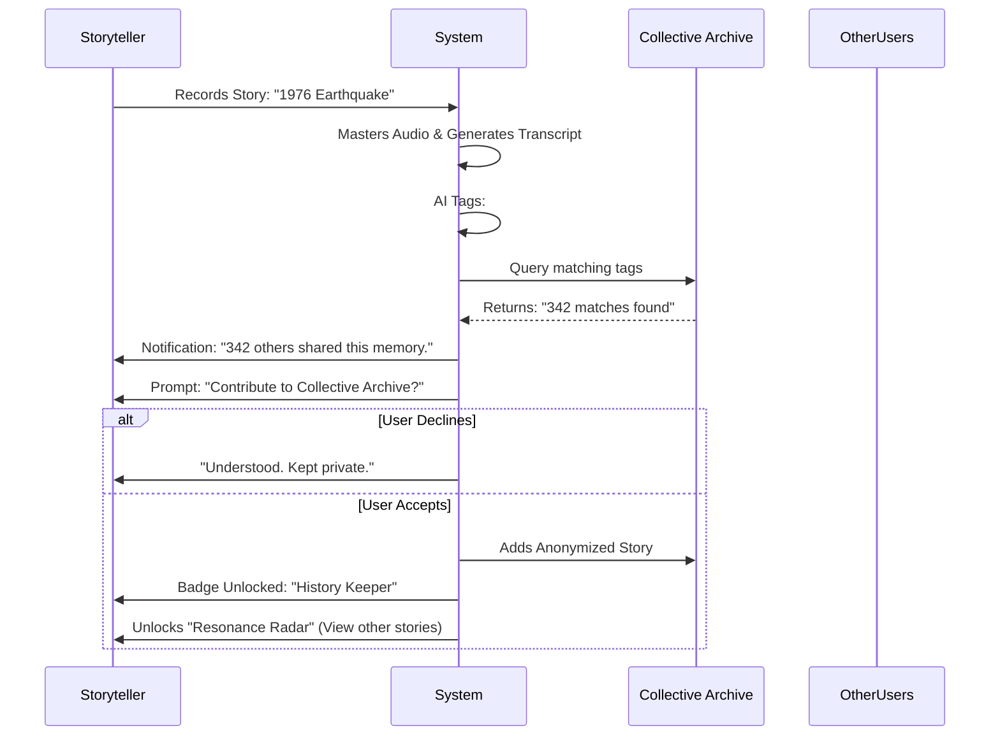

# **Product Requirements Document: UR Saga - V1.8 (MVP)**

## **1. Revision History & Strategic Context**

| Version | Date | Author | Revision Details |
| :--- | :--- | :--- | :--- |
| **V1.8** | 2025-12-01 | AIO-PM | **Strategic Pivot: "The Audiobook & Resonance Edition".** <br>1. **Rebranding:** Renamed to "UR Saga" to avoid trademark conflicts and emphasize "Your Origin".<br>2. **Audio First:** Shifted deliverable focus from "Text Book" to "NPR-Style Audiobook".<br>3. **Dual-Mode Recording:** Introduced "Deep Dive" (Long) & "Chat" (Short) modes with specialized Web audio handling.<br>4. **The "Resonance" Engine:** Defined the "Private-to-Public" bridge via emotional solidarity hooks.<br>5. **Taxonomy:** Adopted a "Timeline-First, Tag-Later" structure based on MECE principles. |
| V1.6 | 2025-11-XX | AIO-PM | Pivot to **Web-First Platform** (PWA) to eliminate app store friction. |
| V1.1 | 2025-10-XX | AI PM | Initial Mobile App MVP definition. |

### **1.1 Strategic Rationale for V1.8**
*   **The "NPR" Audio Standard:** Unlike competitors who treat audio merely as raw material for text, UR Saga treats the *voice itself* as the primary asset. We will implement an AI Audio Pipeline that removes silence and optimizes levels without destroying the speaker's authenticity (The "NPR Producer" Persona).
*   **The "Resonance" Moat:** To build a defensible "Collective Memory" database without violating privacy, we introduce a *post-analysis* incentive loop. Users are invited to share only after realizing their story connects them to a larger historical cohort ("You are not alone").
*   **Technical Robustness:** Addressing the fragility of Web-based recording via "Chunked Uploads" and "Screen Wake Lock" APIs.

---

## **2. Project Vision & Objectives**

### **2.1 The Core Problem**
Family stories are often lost because recording them feels like "work," and the results often feel like "raw data." Furthermore, seniors often feel their memories are trivial or isolated. They lack the motivation to record and the technical confidence to use complex apps.

### **2.2 MVP Objectives (V1.8)**
1.  **Experience:** Validate that a **Web-First, link-based entry** combined with **Dual-Mode Recording** can achieve >80% recording success rates for seniors (70+).
2.  **Quality:** Prove that automated **"NPR-style" audio processing** creates an "Audiobook" experience that Facilitators value enough to share and save.
3.  **Growth:** Test if the **"Resonance Notification"** (e.g., "300 others remembered this event") drives >10% of users to opt-in to the Public Collective Archive.

---

## **3. User Personas (Refined)**

*   **Primary User (The Storyteller):** **"The Keeper of History" (70+).**
    *   *Tech Proficiency:* Low. Can use WhatsApp/WeChat but fears "messing up."
    *   *Psychology:* Fears being boring; fears being forgotten; finds comfort in knowing others shared their struggles.
*   **Secondary User (The Facilitator):** **"The Family Archivist" (35-50).**
    *   *Motivation:* Guilt over lack of connection; desire for a high-quality "keepsake" (Audiobook + PDF) to pass down.

---

## **4. Feature Requirements (The "UR Saga" Core)**

### **Module 1: The Storyteller's Web Experience (PWA)**

#### **1.1 Frictionless Onboarding**
*   **Requirement:** Magic Link Authentication. No passwords.
*   **Flow:** Click Link -> "Welcome [Name]" -> "Privacy Pledge" -> Home.
*   **Tech Spec:** Use persistent browser tokens (LocalStorage/Cookies) with a long expiration (1 year) to prevent frequent logouts.

#### **1.2 Dual-Mode Recording Engine (Critical Update)**
To accommodate different storytelling styles and network conditions.

*   **Mode A: "Deep Dive" (Long Recording)**
    *   **Use Case:** Telling a complex story (10-30 mins).
    *   **UI:** Immersive full screen. Darker background (focus).
    *   **The "Silent Guide":** If the mic detects silence >20s, a gentle text prompt fades in: *"It's okay to take your time. What happened next?"* (Toggleable by Facilitator).
    *   **Technical Implementation:**
        *   **Screen Wake Lock API:** MUST prevent the phone from sleeping during recording.
        *   **Chunked Uploads:** Slice audio every 60 seconds (using `MediaRecorder` API `timeslice`) and upload in background. If one chunk fails, retry automatically. Prevents data loss if the browser crashes at minute 29.
    *   **Logic:** Users can pause/resume.

*   **Mode B: "Chat Bubbles" (Short Recording)**
    *   **Use Case:** Quick anecdotes or clarifications (1-3 mins).
    *   **UI:** WhatsApp-style interface. Hold-to-record or Tap-to-record (Configurable).
    *   **Logic:** Each recording is a "bubble" (max 60s). Users can stack bubbles.
    *   **Synthesis:** Upon clicking "Finish," the system stitches these bubbles into a single track for the final story artifact.

#### **1.3 The "Review & Polish" Step**
*   **User Story:** "As a Storyteller, I want to sound good, not confused."
*   **Feature:** Before sending, the user sees a "Review" screen.
*   **Auto-Leveling (Client-side preview):** The preview playback should have basic volume normalization applied immediately so they can hear themselves clearly.

### **Module 2: The "NPR" AI Audio Pipeline (Backend)**

*   **Input:** Raw, potentially noisy, chunked audio files.
*   **Process (The "Secret Sauce"):**
    1.  **Stitching:** Reassemble chunks/bubbles.
    2.  **Noise Reduction:** Remove steady-state background noise (hiss/hum).
    3.  **Smart Silence Truncation:** Shorten silences >3s to 0.8s (natural pause), *unless* the context suggests a poignant pause (Phase 2 advanced feature, MVP uses simple truncation).
    4.  **De-clicking/De-breathing:** Reduce harsh mouth sounds.
    5.  **Loudness Normalization:** Target -16 LUFS (Podcast standard).
*   **Output:** A "Mastered" MP3 file for the Facilitator.

### **Module 3: Taxonomy & Structure (Timeline First)**

*   **Logic:** All stories are anchored to a **User-Defined Date/Era** (e.g., "1980s" or "When I was 10").
*   **Visuals:** The "Table of Contents" is a vertical Timeline.
*   **Tagging (Background):** LLM analyzes the transcript *after* submission and assigns hidden tags (e.g., #Resilience, #Love, #Food). These are used later for the "Resonance" feature but do not clutter the MVP UI.

### **Module 4: The "Resonance" Engine (The Moat)**

*   **Trigger:** Post-processing of a story.
*   **Logic:** If the story matches a high-frequency cluster in the global database (e.g., "Moon Landing," "COVID-19," "First Car"), send a "Resonance Notification."
*   **Notification Copy:** *"Your story about the 1976 Earthquake is powerful. 342 other community members remember that day, too. You are not alone."*
*   **Call to Action:** *"Would you like to anonymously add this specific story to the UR Saga Collective Archive? (Yes/No)"*

### **Module 5: Deliverables (The Product)**

*   **The Audiobook:** A generated playlist of "Mastered" audio files, organized by Timeline, with AI-generated intro/outro text (read by a synthetic voice).
*   **The E-Book (PDF):** High-quality typeset PDF containing photos + edited transcripts. Ready for home printing.

---

## **5. Technical Implementation & Verification**

### **5.1 Architecture: Web-First + Offline Resilience**
*   **Frontend:** React / Vue.js (PWA).
*   **Local Storage:** `IndexedDB` is MANDATORY. Audio chunks are saved locally immediately. If network fails, the user is alerted, but data is safe on the device until connection restores.
*   **Audio Codec:** Use `Opus` inside a `WebM` container for high quality at low bandwidth during upload. Convert to `MP3/AAC` on server for compatibility.

### **5.2 Key Technical Metrics (Success Criteria)**
1.  **Wake Lock Success Rate:** >95% of recording sessions successfully prevent screen sleep.
2.  **Chunk Reassembly Accuracy:** 100%. No audible "gaps" or "clicks" at the 60s stitch points.
3.  **Upload Resilience:** System must demonstrate recovery from a "Flight Mode on/off" test during upload without data loss.

---

## **6. Visualizing the Logic**

### **Diagram 1: The "Dual-Mode" Recording & Processing Pipeline**

```mermaid
%%{init: {'theme': 'base', 'themeVariables': { 'fontFamily': 'Arial, sans-serif'}}}%%
graph TD
    subgraph Client [Browser / PWA]
        Start(User Starts Recording) --> Mode{Select Mode}
        
        Mode -- "Deep Dive (Long)" --> API_Lock[Request Screen Wake Lock]
        API_Lock --> Rec_Long[MediaRecorder Start]
        Rec_Long -- Every 60s --> Slice[Create Blob Slice]
        Slice --> Store[Save to IndexedDB]
        Store --> Upload[Background Upload Chunk]
        
        Mode -- "Chat (Short)" --> Rec_Short[Record Bubble 1..N]
        Rec_Short --> StoreBubble[Save locally]
        StoreBubble -- User Clicks Finish --> UploadBubble[Upload All Bubbles]
        
        Upload -- Fail --> Retry[Queue for Retry]
        UploadBubble -- Fail --> Retry
    end

    subgraph Server [Backend Cloud]
        Upload & UploadBubble --> RawBucket[Raw Audio Storage]
        RawBucket --> Assembler[Stitching Service]
        Assembler --> AudioEngine[**"NPR" Audio Processor**]
        
        subgraph AudioEngine
            P1[Noise Reduction] --> P2[Silence Truncation]
            P2 --> P3[Loudness Normalization]
        end
        
        AudioEngine --> MasterBucket[Mastered MP3 Storage]
        MasterBucket --> STT[Speech-to-Text]
        STT --> LLM[Topic Analysis & Tagging]
        LLM --> Resonance[**Resonance Matcher**]
    end

    subgraph UserFeedback
        Resonance -- Match Found --> Notify["You are not alone" Notification]
        MasterBucket --> Playback[Facilitator listens to High-Quality Audio]
    end
```

### **Diagram 2: The "Resonance" Incentive Loop**



---

## **7. Open Questions & Risks**

1.  **Storage Costs:** Storing dual versions (Raw + Mastered) of high-quality audio is expensive. need a lifecycle policy (e.g., delete Raw after 30 days?).
2.  **Browser Compatibility:** Safari on iOS has specific quirks with `MediaRecorder` and `Wake Lock`. Strict cross-browser testing is required.
3.  **Legal/Privacy (Collective Archive):** The "Opt-in" consent must be granular. "Can we use your voice? Or just the text?" Needs clear legal UX.

---

### **一、 业务流程图 (Business Process Flowchart)**

**第一性原理应用：**
这里的核心“元过程”是 **价值交换**。
1.  **输入端：** 讲述者的“原始语音” + 情感劳动。
2.  **黑盒处理：** 系统的“NPR级音频工程” + “共鸣匹配”。
3.  **输出端：** 子女获得的“高质量有声书” + 讲述者获得的“共鸣慰藉”。

我们将流程分为三个泳道：**讲述者 (John)**、**系统 (UR Saga Engine)**、**整理者 (Alex)**。

```mermaid
%%{init: {'theme': 'base', 'themeVariables': { 'fontFamily': 'Arial, sans-serif', 'primaryColor': '#fff', 'edgeLabelBackground':'#f4f4f4'}}}%%
graph TD
    subgraph Facilitator [整理者 Alex]
        F1(发现 UR Saga<br/>Web 落地页) --> F2(购买服务包<br/>Magic Link 登录)
        F2 --> F3(创建项目<br/>生成邀请链接)
        F3 --> F4(发送链接给父亲)
        
        F_Listen(收到新故事通知) --> F_Play(播放"NPR级"音频<br/>查看时间轴)
        F_Play --> F_Interact(评论 / 追问)
        F_Interact --> F_Wait(等待回复)
        
        F_Export(项目完成) --> F_Download(下载 PDF + MP3有声书)
    end

    subgraph System [UR Saga 智能引擎]
        S1(验证 Magic Link<br/>建立长效 Token)
        S2(提供 AI 引导问题)
        
        %% 核心音频处理管线
        S_Rec(接收音频切片 Chunking) --> S_Merge(合并切片)
        S_Merge --> S_NPR(AI 音频工程处理<br/>降噪/剪辑/响度均衡)
        S_NPR --> S_STT(生成转录稿 & 时间轴标签)
        
        %% 共鸣引擎
        S_STT --> S_Analyze(语义分析 & 话题提取)
        S_Analyze --> S_Match{全球库匹配?}
        S_Match -- 高共鸣 --> S_Notify_R(触发共鸣通知)
        S_Match -- 无匹配 --> S_Save(仅存档)
        
        S_Save & S_Notify_R --> S_Push(推送给 Alex)
    end

    subgraph Storyteller [讲述者 John]
        J1(点击 WhatsApp 链接) --> J2(一键接受 & 隐私承诺)
        J2 --> J3(进入 Web 主页)
        J3 --> J4{选择录音模式}
        
        J4 -- 深度模式 --> J5(长录音<br/>*防锁屏开启*)
        J4 -- 聊天模式 --> J6(短气泡<br/>*即时发送*)
        
        J5 --> J_Pause{停顿 > 20s?}
        J_Pause -- 是 --> J_Guide(显示 AI 引导文字)
        J_Pause -- 否 --> J_Cont(继续讲述)
        
        J5 & J6 --> J7(完成录制) --> J8(本地预览 & 自动电平)
        J8 --> J9(确认发送)
        
        J9 --> S_Rec
        
        S_Notify_R -.-> J_Resonance(收到共鸣通知<br/>"342人也记得这件事")
        J_Resonance --> J_OptIn{是否加入<br/>集体记忆库?}
        J_OptIn -- 是 --> J_Public(脱敏入库<br/>获得徽章)
        J_OptIn -- 否 --> J_Private(保持私密)
        
        J_Interact(收到 Alex 的追问) --> J3
    end

    %% 关键连接
    F4 --> J1
    S_Rec --> S_Merge
    J9 --> S_Push
    F_Interact --> S_Push --> J_Interact
```

---

### **二、 产品结构图 (Product Structure Diagram)**

**金字塔原理应用：**
我们将产品按照 **“端 (Client)”** 进行顶层分类，向下拆解为 **“功能模块 (Module)”**，再到底层 **“原子能力 (Feature)”**。
*   **讲述者端：** 追求极简（Less is More）。
*   **整理者端：** 追求掌控（Control & Consumption）。
*   **服务端：** 追求智能（Intelligence）。

```mermaid
%%{init: {'theme': 'base', 'themeVariables': { 'fontFamily': 'Arial, sans-serif'}}}%%
mindmap
  root((UR Saga V1.8<br/>Web Platform))
    ::icon(fa fa-globe)
    
    Storyteller_Web [讲述者端 (PWA)]
        ::icon(fa fa-microphone)
        **极简接入层**
            Magic Link 验证 (无密码)
            隐私承诺页 (Privacy Pledge)
            长效 Token 管理
        **双模录音引擎**
            ::icon(fa fa-record-vinyl)
            **深度模式 (Deep Dive)**
                屏幕唤醒锁 (Wake Lock API)
                后台分片上传 (Chunking)
                静默引导 (Silent Guide)
            **聊天模式 (Chat Bubbles)**
                按住说话/点击说话
                气泡堆叠逻辑
        **回顾与发送**
            客户端音频预览 (Auto-Leveling)
            提交确认
        **共鸣反馈系统**
            共鸣通知卡片 ("You are not alone")
            集体记忆加入开关 (Opt-in)
        **我的故事**
            时间轴视图
            子女互动查看 (评论/追问)

    Facilitator_Web [整理者端 (Web Dashboard)]
        ::icon(fa fa-columns)
        **项目管理**
            购买/订阅 (Stripe)
            成员邀请 (生成链接)
            双向身份切换 (既是子女也是父母)
        **故事流 (消费核心)**
            ::icon(fa fa-headphones)
            **NPR 播放器**
                波形可视化
                倍速播放
                章节跳转
            **时间轴视图 (Timeline)**
            搜索与筛选 (按标签/时间)
        **编辑与协作**
            转录稿校对
            追问/评论工具
            AI 引导开关配置
        **交付物生成**
            PDF 排版引擎
            有声书打包下载 (MP3 Playlist)

    Backend_Brain [服务端智能引擎]
        ::icon(fa fa-brain)
        **音频处理管线 (NPR Pipeline)**
            降噪 (Noise Reduction)
            智能剪辑 (Silence Truncation)
            响度标准化 (-16 LUFS)
        **语义分析引擎**
            STT 转录
            时间轴提取 (Time Anchor)
            话题聚类 (Topic Cluster)
        **共鸣匹配系统**
            向量数据库检索 (Vector Search)
            隐私脱敏处理
```

---

### **三、 页面流转图 (Page Flow Diagram)**

**核心设计哲学：**
*   **Happy Path (快乐路径)：** 所有的设计都为了让用户以最少的点击次数完成“录音并发送”。
*   **Error Prevention (防错)：** 在 Web 环境下，录音中断是最大风险，因此流程中隐含了自动恢复机制。

**主要展示：讲述者 (Storyteller) 的核心路径**

```mermaid
%%{init: {'theme': 'base', 'themeVariables': { 'fontFamily': 'Arial, sans-serif'}}}%%
graph TD
    Start((开始)) --> Link[点击邀请链接]
    Link --> Check{Token有效?}
    
    Check -- 否/过期 --> Privacy[**隐私承诺页**<br/>"您的故事仅家人可见"<br/>(隐式登录)]
    Check -- 是 --> Home
    
    Privacy -- 点击"我同意" --> Home[**主页 (Home)**<br/>显示当前AI问题<br/>双模选择入口]
    
    Home -- 选择"深度模式" --> Rec_Long[**深度录音页**<br/>全屏沉浸/黑色背景<br/>*Wake Lock Active*]
    Home -- 选择"聊天模式" --> Rec_Chat[**聊天录音页**<br/>IM对话式界面]
    
    Rec_Long -- 点击结束 --> Review[**预览与发送页**<br/>听回放/重录/发送]
    Rec_Chat -- 点击完成 --> Review
    
    Rec_Long -- 异常中断(锁屏/来电) --> Home
    Home -- 检测到未完成草稿 --> Recovery{检测到草稿<br/>是否恢复?}
    Recovery -- 是 --> Rec_Long
    
    Review -- 点击发送 --> Success[**发送成功页**]
    
    Success -- 触发共鸣 --> Resonance[**共鸣提示弹窗**<br/>"342人也记得这件事..."]
    Resonance -- 选择是否加入 --> Home
    Success -- 无共鸣 --> Home
    
    Home -- 点击"我的故事" --> List[**故事列表页**<br/>时间轴视图]
    List -- 点击故事 --> Detail[**故事详情页**<br/>查看子女评论/追问]
    Detail -- 点击"回答" --> Rec_Long
```

---

### **四、 页面元素清单 (Page Element List)**

这是给 UI 设计师和前端开发的直接指令。我们重点拆解 **讲述者端 (Storyteller PWA)** 的核心页面。

#### **P1: 隐私承诺页 (Landing / Privacy Pledge)**
*   **目标：** 建立信任，完成“无感登录”。
*   **元素：**
    *   `Avatar Group`: 显示邀请者（子女）的头像。
    *   `Welcome Text`: “Hi [John], [Alex] 邀请您以此记录家族回忆。”
    *   `Privacy Shield Icon`: 巨大的盾牌图标，强调安全。
    *   `Pledge Text`: **“您的声音属于您。未经允许，内容仅限此圈子可见。”** (大号字体)
    *   `Primary Button`: “接受并开始” (Accept & Start)。
    *   `Tech Note`: 底部小字“本应用无需下载，建议添加到主屏幕”。

#### **P2: 主页 (Home / Recorder Hub)**
*   **目标：** 引导灵感，选择录音方式。
*   **元素：**
    *   `AI Prompt Card`:
        *   `Topic Label`: 例如 “1980年代 · 职业生涯”。
        *   `Question Text`: “您第一份工作是在哪里？当时印象最深的人是谁？”
        *   `Shuffle Icon`: “换一个问题”。
    *   **`Mode Selector` (核心交互区域):**
        *   **Option A: Deep Dive (深度模式)**
            *   `Icon`: 麦克风图标。
            *   `Label`: “讲述长故事”。
            *   `Sub-text`: “适合 5-30 分钟的详细回忆”。
        *   **Option B: Chat (聊天模式)**
            *   `Icon`: 气泡图标。
            *   `Label`: “简单聊两句”。
            *   `Sub-text`: “像微信一样发送短语音”。
    *   `Draft Banner`: (仅当有草稿时显示) “您有一段未发送的录音 [恢复]”。
    *   `Navigation Bar`: 录音 (Active) | 故事库 (New Badge)。

#### **P3: 深度录音页 (Deep Dive Recorder)**
*   **目标：** 沉浸式录音，防止干扰，确保技术稳定。
*   **状态：录音中 (Recording)**
    *   `Background`: 深色/黑色 (省电且专注)。
    *   `Wake Lock Indicator`: (隐形) 浏览器地址栏不应有锁屏警告。
    *   `Timer`: 大号数字 `04:23`。
    *   `Visualizer`: 动态声波纹，随音量跳动 (给用户反馈“正在录”)。
    *   `AI Guide Text`: (Fade in if silence > 20s) “别着急，慢慢想... 后来呢？”
    *   `Photo Add Button`: 允许录音过程中拍摄/上传老照片。
    *   `Stop Button`: 巨大的红色方块。
    *   `Pause Button`: 暂停/继续。

#### **P4: 预览与发送页 (Review & Send)**
*   **目标：** 质量把关，赋予用户掌控感。
*   **元素：**
    *   `Waveform Player`: 显示整个音频波形。
    *   `Auto-Level Badge`: “✨ 已自动优化音质” (给用户心理暗示)。
    *   `Play/Pause Control`.
    *   `Date Picker`: **“这件事大约发生在哪一年？”** (默认当前年份，用户可滚轮调整，这是 V1.8 “时间轴优先”的关键数据输入)。
    *   `Primary Button`: “发送给家人” (Send to Family)。
    *   `Secondary Button`: “重录” (Re-record)。

#### **P5: 共鸣反馈弹窗 (Resonance Modal)**
*   **目标：** 转化“私有”为“公有”，建立护城河。
*   **触发：** 发送成功后，若后台 AI 匹配到高频话题。
*   **元素：**
    *   `Resonance Icon`: 雷达/连接图标。
    *   `Headline`: “您并不孤单。”
    *   `Body Text`: “关于 **[1976年]** 的记忆，全球已有 **342** 位长辈分享了他们的故事。您的经历是这幅历史拼图中珍贵的一块。”
    *   `Action`: “将此故事匿名加入‘人类集体记忆库’？”
    *   `Yes Button`: “加入并查看他人故事”。
    *   `No Button`: “不，仅家人可见”。