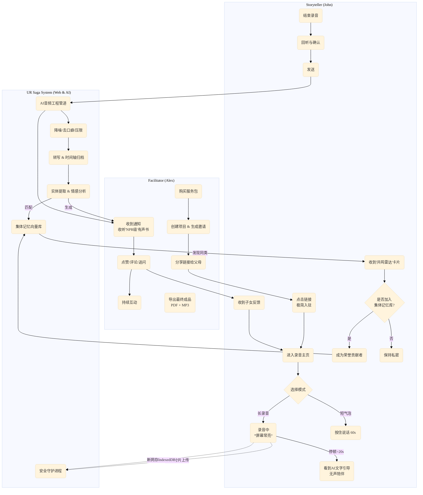
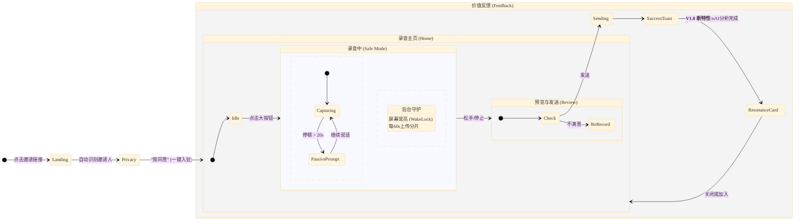

# **Product Requirements Document: UR Saga - V1.8**

## **1. Revision History & Strategic Context**

| Version | Date | Author | Revision Details & Strategic Rationale |
| :--- | :--- | :--- | :--- |
| **V1.8** | 2025-11-29 | AIO-PM | **Strategic Pivot: "The Collective Moat" & "Resilient Audio".**<br>1. **Rebranding:** Renamed to "UR Saga" to avoid trademark conflicts and emphasize "Your Story".<br>2. **Collective Memory:** Introduced the "Resonance Radar" mechanism to incentivize public sharing (The Moat), moving beyond a private archive tool.<br>3. **Audio Engineering:** Defined the AI's role as an "NPR Producer" (polishing flow while keeping authenticity).<br>4. **Tech Hardening:** Detailed technical specs for Web Audio reliability (Wake Lock, Chunked Uploads, Local Fallback) to mitigate browser limitations.<br>5. **Structure:** Adopted a strict **Chronological (Time-based)** default for the MVP to lower cognitive load. |
| V1.6 | 2025-11-XX | AIO-PM | **Platform Pivot:** Shifted from Native App to **Web-First** to eliminate download friction for seniors. |
| V1.1 | 2025-10-XX | AI PM | Initial MVP definition focusing on the B2C2C interaction loop. |

## **2. Project Vision**

### **2.1 The Core Problem**
While families struggle to preserve personal histories, a deeper issue exists: **The loneliness of individual destiny.** People often feel their struggles (e.g., immigration, economic crises, pandemics) are isolated burdens. Current solutions offer private storage but fail to connect these "micro-histories" into a broader tapestry of human experience, missing the opportunity to provide deep emotional validation through shared memory.

### **2.2 MVP Objectives (V1.8)**
1.  **The "Resilient Recorder" Goal:** Prove that a browser-based interface can reliably capture 10+ minute narratives from non-technical seniors without data loss.
2.  **The "NPR Quality" Goal:** Validate that AI post-processing can turn raw, pausing, stammering speech into a listenable, "Radio-Quality" audiobook experience.
3.  **The "Moat" Goal:** Validate that users are willing to anonymize and share their private stories to the "Collective Memory Bank" when presented with the emotional hook of "finding your generation."

## **3. User Personas & New Scenarios**

*   **User B: The Facilitator (Alex)** - *The Archivist.* Wants a high-quality output (Audiobook) to justify the cost.
*   **User A: The Storyteller (John)** - *The Witness.* 70 years old. Needs technical forgiveness and emotional validation.

### **3.1 The "Resonance" Scenario (New)**
1.  **Recording:** John records a 15-minute story about his first day in a new country in 1980.
2.  **Processing:** The system processes the audio.
3.  **The Hook:** John receives a notification: *"John, your story about **1980** is powerful. We found **1,240 other people** who also felt lost in a new city that year. You are not alone."*
4.  **The Action:** John clicks "View Shared Memories." He sees a heat map or word cloud of that era.
5.  **The Conversion:** A prompt asks: *"Would you like to anonymously add your story to this Public History Archive? Help future generations understand 1980."* John clicks **"Yes."**

## **4. Feature Requirements (MVP)**

### **Module 1: The "Resilient" Recorder (Storyteller Web App)**

This is the most critical technical module. It must fail-safe against screen locks and network drops.

*   **User Story 1.1: Long-Form Recording with "Passive AI Company"**
    *   **Logic:**
        *   **Screen Wake Lock:** Upon clicking "Record," the browser calls the `navigator.wakeLock.request('screen')` API to prevent the phone from sleeping.
        *   **Passive Interaction:** If the user is silent for >20 seconds, a **text-based prompt** gently fades in on the screen (e.g., *"What were you wearing that day?"* or *"Take your time..."*). It fades out after 10 seconds. **No audio interruption.**
        *   **Chunked Uploading:** The audio stream is sliced into 60-second `blobs` and uploaded in the background. If the recording crashes at minute 9, the first 8 minutes are already safe on the server.
    *   **Success Metric:** < 1% data loss rate on recordings > 10 minutes.

*   **User Story 1.2: Short-Form "Bubble" Mode (Fallback)**
    *   **Context:** For quick replies or poor connections.
    *   **Logic:** Acts like WhatsApp/iMessage voice notes. Max 60 seconds per bubble. Users can string them together.
    *   **Synthesis:** The backend stitches these bubbles into one cohesive file for the final output.

*   **User Story 1.3: Local Storage Fallback**
    *   **Logic:** If the network is undetectable (`navigator.onLine === false`), the audio data is stored in the browser's `IndexedDB`.
    *   **Recovery:** When the user re-opens the page with a connection, the system detects the local file and prompts: *"We found an unsent story. Uploading now..."*

### **Module 2: The "NPR" AI Sound Engineer (Backend)**

*   **User Story 2.1: Intelligent Audio Mastering**
    *   **Logic:** The raw audio goes through an AI pipeline (e.g., utilizing tools/libraries like FFMPEG + AI Noise profiles):
        1.  **Denoise:** Remove constant background hum (AC, traffic).
        2.  **De-click/De-breath:** Reduce harsh mouth sounds (optional, adjustable).
        3.  **Silence Truncation:** Shorten silences > 4 seconds down to 1.5 seconds (to keep flow but retain "thinking" pauses).
        4.  **Leveling:** Normalize volume to standard broadcast levels (-16 LUFS).
    *   **Output:** Creates a "Mastered Version" for listening, while keeping the "Raw Version" as a backup.

*   **User Story 2.2: The Chronological Weaver**
    *   **Logic:**
        *   **Input:** User selects a broad era before recording (e.g., "Childhood") OR AI infers date from speech (e.g., "In 1975...").
        *   **Structure:** The "Table of Contents" is strictly **Time-Based** (e.g., 1950-1960, 1960-1970). This is the only way to auto-organize messy memories reliably in MVP.
        *   **Tagging:** Thematic tags (e.g., "Love," "Career") are applied as metadata *filters*, not the primary folder structure.

### **Module 3: The Collective Memory Moat**

*   **User Story 3.1: The Resonance Radar**
    *   **Trigger:** Occurs *after* a story is processed and transcribed.
    *   **Logic:** NLP analyzes the transcript for entities (Dates, Locations, Major Events like "9/11", "Moon Landing", "Immigration").
    *   **Feedback:** Displays a "Resonance Card" to the Storyteller: *"Your story connects with [Event/Era]. [X] other users have shared memories about this."*
    *   **Opt-In:** A toggle switch: **"Contribute to Public History (Anonymized)."**

### **Module 4: The Deliverable (Facilitator Value)**

*   **User Story 4.1: The "Radio-Show" Export**
    *   **Logic:** Facilitator clicks "Export Audiobook."
    *   **Output:** A ZIP file containing:
        1.  **The Audiobook (MP3):** Organized by Chapter (Decade). Includes an AI-generated Intro/Outro (optional).
        2.  **The Companion Book (PDF):** High-resolution PDF ready for print. Contains photos, transcripts, and a QR code linking to the original audio.

## **5. Technical Implementation Details**

### **5.1 Audio Pipeline Strategy**
To ensure reliability on Mobile Safari (iOS) and Chrome (Android):

1.  **Format:** Record in `WebM` (Opus codec) for Android/Desktop and `AAC/MP4` for iOS (if supported, otherwise fallback to WAV then convert).
2.  **Wake Lock:**
    ```javascript
    // Conceptual Implementation
    let wakeLock = null;
    async function requestWakeLock() {
      try {
        wakeLock = await navigator.wakeLock.request('screen');
      } catch (err) {
        console.error(`${err.name}, ${err.message}`);
      }
    }
    ```
3.  **Safety Slicing (The "Black Box" Recorder):**
    *   Do not wait for the "Stop" button to upload.
    *   Every 60 seconds -> `mediaRecorder.requestData()` -> Send Blob to Server -> Server appends to temporary file.
    *   If browser crashes at 09:30, server has 00:00-09:00 saved.

### **5.2 AI Tech Stack (Suggestion)**
*   **STT (Transcription):** OpenAI Whisper (API) or Deepgram (optimized for speed/streaming).
*   **NLP (Tagging/Resonance):** LLM (GPT-4o-mini or similar) to extract "Time," "Location," "Emotion," and "Historical Events."
*   **Audio Processing:** Python backend using `pydub` or specialized API like Auphonic (if budget allows) for the "NPR" mastering effect.

## **6. Success Metrics (V1.8)**

| Metric | Definition | Target (MVP) |
| :--- | :--- | :--- |
| **Technical Reliability** | % of recordings >5 mins that complete upload without error | > 98% |
| **Moat Velocity** | % of users opting into "Public Collective Memory" | > 15% |
| **Content Depth** | Average duration of "Long Mode" recordings | > 8 mins |
| **Listener Satisfaction** | % of Facilitators who download the final Export | > 40% |

## **7. Appendix: The "NPR Producer" Logic Flow**

```mermaid
graph TD
    User[Storyteller] -->|Records Raw Audio| Browser
    Browser -->|Chunked Upload (60s)| Server[Temp Storage]
    User -->|Clicks Stop| Browser
    Browser -->|Final Chunk| Server
    
    subgraph "The AI Sound Engineer"
        Server -->|Raw File| FFMPEG[Audio Processor]
        FFMPEG -->|Step 1: Denoise Profile| Audio_V1
        Audio_V1 -->|Step 2: Silence Truncation (>2s -> 1s)| Audio_V2
        Audio_V2 -->|Step 3: Loudness Normalization (-16 LUFS)| Mastered_Audio
    end
    
    subgraph "The Historian & Connector"
        Mastered_Audio -->|Whisper API| Transcript
        Transcript -->|LLM Analysis| Meta[Metadata: Date, Topic, Sentiment]
        Meta -->|Search Vector DB| Cluster[Find Similar Stories]
        Cluster -->|Generate Feedback| Notification["You are not alone..."]
    end
    
    Notification --> User
```

---

以下是为 **UR Saga V1.8 (Web-First MVP)** 定制的四大核心文档。

### **一、 业务流程图 (Business Process Diagram)**

**第一性原理视角：**
UR Saga 的本质是一个 **“非对称的双边价值交换系统”**。
1.  **输入端 (Storyteller):** 并不是在“录音”，而是在进行“记忆的数据化”。核心难点是**数据的安全性**（防丢失）和**动机的持续性**（防流失）。
2.  **处理端 (System):** 将“原始数据（Raw Audio）”转化为“资产（Mastered Audiobook）”。
3.  **输出端 (Facilitator):** 为“资产”付费，并提供“情感反馈”作为输入端的燃料。
4.  **V1.8 增量 (Collective Moat):** 在闭环外增加一个“共鸣出口”，将私人记忆转化为公共价值。



---

### **二、 产品结构图 (Product Structure Diagram)**

**金字塔原理视角：**
我们将产品自顶向下分解为三个相互独立的子系统。
*   **塔尖：** UR Saga Web Platform。
*   **中间层：** 针对不同角色的“端” (App B, App A, Backend)。
*   **底层：** 支撑功能的具体模块。**V1.8 的重点在于强化“音频处理引擎”和“集体记忆库”。**

```mermaid
%%{init: {'theme': 'base', 'themeVariables': { 'fontFamily': 'Arial, sans-serif'}}}%%
mindmap
  root((UR Saga V1.8<br/>Web Platform))
    ::icon(fa fa-globe)

    subgraph **Facilitator Web App**<br/>(The Archivist)
        **控制台 (Dashboard)**
            资源钱包 (Project Vouchers)
            项目列表
            成员管理 (Co-Facilitators)
        **故事流 (Feed)**
            时间轴视图 (1960s, 1970s...)
            播放器 (倍速/跳过空白)
            互动区 (评论/追问)
        **导出中心 (Export)**
            有声书生成器 (MP3 Zip)
            伴读手册生成器 (PDF)
    end

    subgraph **Storyteller Web App**<br/>(The Witness)
        **录音机 (Recorder)**
            ::icon(fa fa-microphone)
            **长录音模式 (Resilient)**
                唤醒锁 (Wake Lock)
                被动式AI文字引导
                分片上传守护
            **短气泡模式 (Fallback)**
            本地草稿箱 (断网恢复)
        **回忆博物馆 (My Saga)**
            我的故事列表
            子女反馈消息箱
        **共鸣雷达 (Resonance)**
            ::icon(fa fa-broadcast-tower)
            共鸣卡片 ("您与1240人有共同记忆")
            集体记忆库贡献开关 (Opt-in)
    end

    subgraph **Intelligent Backend**<br/>(The NPR Producer)
        **音频工程管道**
            ::icon(fa fa-sliders-h)
            降噪 (Denoising)
            静音截断 (Silence Truncation)
            响度标准化 (Loudness Norm)
        **AI 认知引擎**
            STT 转写 (Whisper)
            时间轴自动归档 (NLP)
            **共鸣匹配算法** (Vector Search)
        **数据安全核心**
            加密存储
            匿名化处理 (针对公开数据)
    end
```

---

### **三、 页面流转图 (Page Flow Diagram)**

**设计重点：**
重点展示 **Storyteller (John)** 的体验路径。在 V1.8 中，我们必须确保从“点击链接”到“录音结束”的路径是**零摩擦且高容错**的。



---

### **四、 核心页面元素清单 (Page Elements List)**

这份清单指导 UI 设计师和前端开发。加粗部分为 **V1.8 特有** 的关键元素。

#### **A. 讲述者端 (Storyteller) - 录音主页 (Recorder Home)**
这是整个产品的核心界面，要求极致简洁但技术复杂。

| 区域 | 元素名称 | 功能/交互逻辑 | V1.8 技术备注 |
| :--- | :--- | :--- | :--- |
| **Header** | 状态栏 | 显示网络状态（在线/离线）。 | **离线时显示“本地存储中”图标**。 |
| **Prompt** | AI 提问卡 | 显示当前章节的主题问题（如“讲讲童年”）。 | 支持文字大小自动适配。 |
| **Main** | **“按住/点击”录音钮** | 核心交互。视觉上要巨大、有触感。 | **集成 MediaRecorder API**。 |
| **Overlay** | **被动引导浮层** | **(隐形元素)** 仅在录音检测到静音 >20s 时淡入显示文字提示。 | **不打断录音流，仅视觉提示**。 |
| **Status** | 录音波纹 | 实时反馈麦克风输入音量。 | 视觉反馈，确认设备工作正常。 |
| **Footer** | 模式切换 | 切换“长故事模式”与“短气泡模式”。 | 默认为长故事。 |
| **Logic** | **唤醒锁 (Invisible)** | **页面加载即预备，录音开始即激活 `navigator.wakeLock`**。 | **防止手机锁屏导致录音中断**。 |

#### **B. 讲述者端 (Storyteller) - 发送成功与共鸣 (Post-Submission)**
这是建立护城河的关键触点。

| 区域 | 元素名称 | 功能/交互逻辑 | V1.8 技术备注 |
| :--- | :--- | :--- | :--- |
| **Main** | 成功动画 | 给予强烈的正面反馈（烟花/对勾）。 | 心理激励。 |
| **Card** | **共鸣雷达卡 (Resonance)** | 显示：“您的故事关于 [1976年]。有 [3,402] 人也提到了这一年。” | **需后端 NLP 快速分析返回元数据**。 |
| **Action** | **加入集体记忆库 (Toggle)** | 开关：“匿名分享我的故事，帮助完善人类历史。” | **默认关闭。开启需二次确认隐私条款**。 |
| **Nav** | 返回/看反馈 | 返回主页或查看子女的评论。 | - |

#### **C. 整理者端 (Facilitator) - 故事详情页 (Story Detail)**
这是体现“NPR级”音频质量的地方。

| 区域 | 元素名称 | 功能/交互逻辑 | V1.8 技术备注 |
| :--- | :--- | :--- | :--- |
| **Player** | **增强播放器** | 播放 **"Mastered Audio"** (AI处理版)。提供“听原始录音”的切换开关。 | **加载后端处理后的 MP3**。 |
| **Text** | 智能文稿 | 显示 AI 转写的文字。支持点击文字跳转音频进度。 | - |
| **Meta** | 时间轴标签 | 显示 AI 归档的年代（如 "1980-1985"）。 | **支持手动修正时间归档**。 |
| **Action** | 导出单曲 | 下载当前故事的 MP3 和 PDF 页。 | - |

---

### **AIO-PM 结语**
这四份文档构成了一个严密的执行闭环：
1.  **流程图** 确保了我们没有遗漏“分片上传”和“共鸣雷达”这两个关键环节。
2.  **结构图** 明确了后台“音频工程管道”的独立性，这是 V1.8 质量的保证。
3.  **流转图** 验证了 Storyteller 的操作路径依然保持了“傻瓜式”的简单，尽管后台技术很复杂。
4.  **元素清单** 所有的技术复杂度（Wake Lock, IndexedDB）都被封装在了界面之下，对用户不可见。