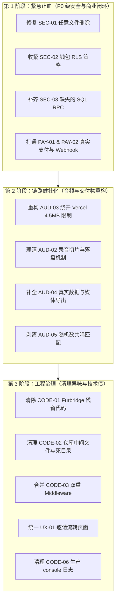

# UR Saga 交付前全面缺陷审计与修复跟踪清单 (Remediation Checklist)

> **文档定位**：本项目由 AI (Codex) 自动化构建。本清单基于对 PRD (`UR saga v1.8.md`)、前端 (Next.js 16/React 19)、服务端 API Route、数据库 (Supabase SQL/RLS)、支付 (Stripe) 以及 AI 编排管线的全面深度源码审计生成。  
> **使用说明**：按优先级从 **P0（阻断级，必须修复才能上线）** 到 **P2（优化级）** 推进，每个条目提供具体的代码位置、风险影响、修复方案与跟踪复选框 `[ ]`。

---

## 📊 修复进度监控看板 (Progress Dashboard)

| 优先级 | 定义与标准 | 问题总数 | 待修复 | 修复中 | 已验证 |
| :--- | :--- | :---: | :---: | :---: | :---: |
| **P0 阻断级** | 安全漏洞、资金/权益被刷、核心流程假实现、服务崩溃/超时 | **10** | 10 | 0 | 0 |
| **P1 严重级** | 核心规格未落地、架构断层、移动端/弱网脆弱、代码混淆污染 | **11** | 11 | 0 | 0 |
| **P2 中/低级** | 规范缺陷、代码异味、国际化残缺、静态资源未优化 | **7** | 7 | 0 | 0 |
| **合计** | 全生命周期闭环治理 | **28** | **28** | **0** | **0** |

---

## 一、 致命安全漏洞与数据合规 (Security & Permissions)

### 🔴 [P0] SEC-01: `api/media/delete-image` 存在无鉴权任意文件删除漏洞
- **状态**：`[ ] 待处理`
- **代码位置**：[`packages/web/src/app/api/media/delete-image/route.ts:4-16`](file:///Users/eat/Documents/eatpotato/saga%E4%BC%A0%E5%A5%87/packages/web/src/app/api/media/delete-image/route.ts#L4-L16)
- **漏洞详情**：该接口直接使用 `getSupabaseAdmin()`（Service Role，无视一切 RLS 策略），且**未调用任何认证函数（没有 `getAuthenticatedUser`）**，直接根据客户端 POST 提交的 `paths` 数组执行 `admin.storage.from('saga').remove(paths)`。
- **潜在危害**：任何未登录攻击者只需调用此接口，即可任意删除云存储中属于其他用户的家庭老照片、头像或录音文件。
- **修复方案**：
  1. 引入 `getAuthenticatedUser(request)`，未登录返回 401。
  2. 校验传入的 path 前缀必须为 `${user.id}/`，或校验该资源在项目中且当前用户具有该项目的所有者/协作者权限。

---

### 🔴 [P0] SEC-02: 客户端 RLS 过于宽松，允许普通用户自行修改资源钱包余额
- **状态**：`[ ] 待处理`
- **代码位置**：
  - SQL 策略：[`supabase/bootstrap/20260624000000_app_base_schema.sql:585-590`](file:///Users/eat/Documents/eatpotato/saga%E4%BC%A0%E5%A5%87/supabase/bootstrap/20260624000000_app_base_schema.sql#L585-L590)
  - 前端越权调用：[`packages/web/src/lib/api-supabase.ts:189-197`](file:///Users/eat/Documents/eatpotato/saga%E4%BC%A0%E5%A5%87/packages/web/src/lib/api-supabase.ts#L189-L197)
- **漏洞详情**：数据库在 `user_resource_wallets` 表上配置的更新策略为 `for update using (auth.uid() = user_id) with check (auth.uid() = user_id)`，没有任何列级权限限制。前端甚至存在直接发起 `.update({ project_vouchers: 1, facilitator_seats: 2 })` 的兜底逻辑。
- **潜在危害**：任何用户可在浏览器控制台或直接通过 Supabase Client 执行任意数值修改，免费刷取无限项目券与席位。
- **修复方案**：
  1. 删除对 `user_resource_wallets` 的客户端 `UPDATE` 和 `INSERT` 策略，禁止普通用户通过客户端 SDK 直接写入该表。
  2. 钱包充值、扣减、赠送全部严格收口到带有权限与幂等锁的数据库存储过程（RPC）或受保护的服务端 API 中。

---

### 🔴 [P0] SEC-03: 核心业务 RPC 存储过程缺失导致生产运行报错瘫痪
- **状态**：`[ ] 待处理`
- **代码位置**：
  - 引用点：[`packages/web/src/app/api/invitations/[token]/accept/route.ts:132`](file:///Users/eat/Documents/eatpotato/saga%E4%BC%A0%E5%A5%87/packages/web/src/app/api/invitations/%5Btoken%5D/accept/route.ts#L132)
  - 引用点：[`packages/web/src/app/api/admin/cleanup-invitations/route.ts:18`](file:///Users/eat/Documents/eatpotato/saga%E4%BC%A0%E5%A5%87/packages/web/src/app/api/admin/cleanup-invitations/route.ts#L18)
  - 引用点：[`packages/web/src/lib/api-supabase.ts:351, 366, 485, 507`](file:///Users/eat/Documents/eatpotato/saga%E4%BC%A0%E5%A5%87/packages/web/src/lib/api-supabase.ts#L351)
- **漏洞详情**：代码中引用的下列数据库函数在 `supabase/bootstrap` 和 `supabase/migrations` 中**完全没有定义**：
  1. `accept_project_invitation` (接受邀请)
  2. `send_project_invitation` (发送邀请)
  3. `cleanup_expired_invitations` (清理过期邀请)
  4. `process_package_purchase` (支付入账)
  5. `request_data_export` (导出申请)
- **潜在危害**：在生产全新数据库或未手动建函数的环境中，任何接受邀请、定时清理或购买核销调用均会抛出 `function does not exist` 致命错误。
- **修复方案**：
  - 在 `supabase/migrations/` 中补充新增这些核心 RPC 的标准 DDL 定义文件，包含事务边界、幂等处理与审计写入。

---

### 🟡 [P1] SEC-04: 内存型固定窗口限流在 Vercel Serverless 环境下形同虚设
- **状态**：`[ ] 待处理`
- **代码位置**：[`packages/web/src/lib/server/rate-limit.ts:20-58`](file:///Users/eat/Documents/eatpotato/saga%E4%BC%A0%E5%A5%87/packages/web/src/lib/server/rate-limit.ts#L20-L58)
- **漏洞详情**：`createFixedWindowLimiter` 使用模块内部的 `new Map<string, Bucket>()`。在 Serverless 环境下，每个请求可能分配到不同的云函数实例或容器冷启动，内存不共享，导致限流失效。
- **潜在危害**：攻击者可并发调用高成本的 `/api/ai/transcribe` 和 `/api/ai/generate-content`，迅速刷爆 OpenAI / OpenRouter 账单。
- **修复方案**：
  - 生产环境对接基于 Redis / Upstash 的分布式限流器（或利用 Supabase 记录调用频次/IP 桶），替代内存 Map。

---

### 🟡 [P1] SEC-05: 依赖包存在 55 个安全漏洞（含 1 个 Critical 和 48 个 High）
- **状态**：`[ ] 待处理`
- **代码位置**：[`package.json`](file:///Users/eat/Documents/eatpotato/saga%E4%BC%A0%E5%A5%87/package.json), [`packages/web/package.json`](file:///Users/eat/Documents/eatpotato/saga%E4%BC%A0%E5%A5%87/packages/web/package.json)
- **漏洞详情**：
  - `next@16.2.6` 存在严重安全通告；
  - `sharp` (libvips / libheif 内存溢出漏洞 CVE-2026-33327 等)；
  - `socket.io-parser` 存在内存耗尽 DoS 风险。
- **修复方案**：
  - 移除完全未使用的冗余依赖（如 `socket.io-client`）；
  - 执行针对性补丁升级，将 Next.js 升至修复版本，更新 `sharp` 及构建链路。

---

## 二、 商业化与支付结算闭环 (Monetization & Payment Pipeline)

### 🔴 [P0] PAY-01: 支付购买页面为纯延时 Mock，无真正扣款与履约
- **状态**：`[ ] 待处理`
- **代码位置**：[`packages/web/src/app/[locale]/dashboard/purchase/page.tsx:30-41`](file:///Users/eat/Documents/eatpotato/saga%E4%BC%A0%E5%A5%87/packages/web/src/app/%5Blocale%5D/dashboard/purchase/page.tsx#L30-L41)
- **问题详情**：前端购买逻辑硬编码为：
  ```ts
  await new Promise(resolve => setTimeout(resolve, 2000))
  router.push(withLocale('/dashboard?purchase=success'))
  ```
  没有调用 Stripe Elements，也没有发起真实支付意向（PaymentIntent）。
- **修复方案**：
  - 接入封装好的 `PaymentForm`，调通 Stripe 支付流程，在确认扣款成功后向服务端验证凭据。

---

### 🔴 [P0] PAY-02: 缺少 Stripe Webhook 服务端回调与权益自动核销
- **状态**：`[ ] 待处理`
- **代码位置**：[`packages/web/src/services/stripe.service.ts:147-168`](file:///Users/eat/Documents/eatpotato/saga%E4%BC%A0%E5%A5%87/packages/web/src/services/stripe.service.ts#L147-L168)
- **问题详情**：
  - 仓库内搜索无任何 Stripe Webhook 路由（无 `/api/payments/webhook` 或类似处理器）。
  - `stripe.service.ts` 中的 `completePurchase` 试图调用 `/api/payments/complete`，而该路由在后端根本不存在！
- **修复方案**：
  - 新增 `/api/payments/webhook` 路由，使用 Stripe 签名密钥 (`STRIPE_WEBHOOK_SECRET`) 进行原生事件验签；
  - 监听 `payment_intent.succeeded` 事件，在数据库事务内为用户发放 `project_vouchers` 和 `seats`，并插入 `seat_transactions` 审计记录。

---

### 🟡 [P1] PAY-03: 套餐定价、席位规格跨文件定义严重冲突
- **状态**：`[ ] 待处理`
- **代码位置**：
  - 共享配置：[`packages/shared/src/config/service-plans.ts`](file:///Users/eat/Documents/eatpotato/saga%E4%BC%A0%E5%A5%87/packages/shared/src/config/service-plans.ts)
  - 前端支付目录：[`packages/web/src/lib/payments/catalog.ts`](file:///Users/eat/Documents/eatpotato/saga%E4%BC%A0%E5%A5%87/packages/web/src/lib/payments/catalog.ts)
  - 落地页文案：[`packages/web/src/app/[locale]/page.tsx`](file:///Users/eat/Documents/eatpotato/saga%E4%BC%A0%E5%A5%87/packages/web/src/app/%5Blocale%5D/page.tsx)
- **问题详情**：套餐名称、价格、赠送的讲述者席位/整理者席位数在多个文件中硬编码且数值不一致。
- **修复方案**：统一将 `@saga/shared/config/service-plans.ts` 作为单一真理源（Single Source of Truth），前端展示与后端意向生成全部引用该配置。

---

## 三、 核心音频与交付物链路 (Audio Pipeline & Core Features)

### 🔴 [P0] AUD-01: PRD 核心资产“NPR 级音频工程管线”完全未实现
- **状态**：`[ ] 待处理`
- **规范要求**：`UR saga v1.8.md` Module 2 明确规定：降噪（Noise Reduction）、智能静音截断（>3s 缩减为 0.8s）、响度标准化（-16 LUFS 播客标准）。
- **现状**：代码中无任何音频后处理服务。原始录音直接上传为 webm，没有任何音频母带处理环节。
- **修复方案**：
  - 明确交付边界：若 MVP 阶段无法自建音频微服务，需在产品规范中调整描述；或在 Serverless/异步任务中使用轻量级 WebAssembly/云端转码服务（如 FFmpeg Lambda）完成至少基本的响度均衡与静音修剪。

---

### 🔴 [P0] AUD-02: 60 秒分片录音为“半截子设计”（上传后丢失合并）
- **状态**：`[ ] 待处理`
- **代码位置**：[`packages/web/src/components/recording/SmartRecorder.tsx:82-112, 516-528`](file:///Users/eat/Documents/eatpotato/saga%E4%BC%A0%E5%A5%87/packages/web/src/components/recording/SmartRecorder.tsx#L82-L112)
- **问题详情**：
  - 前端虽然每 60 秒将 chunk 上传至 `temp/{sessionId}/{index}.webm`；
  - 但录音停止时，前端却在客户端将全部 chunks 拼成完整大 Blob 重新发起全量上传；
  - 后端根本没有“分片合并服务（Chunk Assembler）”。
- **修复方案**：
  - 建立真正可恢复的分片合并机制，或者简化为在客户端完成安全录制并在 IndexedDB 持久化兜底后单通道稳定流式传输。

---

### 🔴 [P0] AUD-03: Vercel 4.5MB 请求体硬限制与转录超时冲突
- **状态**：`[ ] 待处理`
- **代码位置**：[`packages/web/src/app/api/ai/transcribe/route.ts:7, 50`](file:///Users/eat/Documents/eatpotato/saga%E4%BC%A0%E5%A5%87/packages/web/src/app/api/ai/transcribe/route.ts#L7)
- **问题详情**：
  - 代码设定 `MAX_TRANSCRIBE_BYTES = 25 * 1024 * 1024`（25MB）；
  - 但 Vercel Serverless Function 的请求体最大限制为 **4.5MB**。长录音直传转录接口会被网关直接拒绝（413 Payload Too Large）；
  - 同时同步调用 Whisper 转录长音频极易触发 Vercel 15s 超时。
- **修复方案**：
  - 录音先上传至 Supabase Storage 获取存储路径；
  - 转录接口接收音频路径或预签名 URL，由服务端流式拉取或交由后台任务处理，彻底避开请求体与网关超时限制。

---

### 🔴 [P0] AUD-04: 交付物“有声书/PDF 排版引擎”未实现，仅导出粗糙文本
- **状态**：`[ ] 待处理`
- **代码位置**：[`packages/web/src/app/api/projects/[id]/export/route.ts:101-150`](file:///Users/eat/Documents/eatpotato/saga%E4%BC%A0%E5%A5%87/packages/web/src/app/api/projects/%5Bid%5D/export/route.ts#L101-L150)
- **问题详情**：导出接口仅简单打包了 `stories.json` 和 `transcript.txt`。前端勾选的“包含音频”、“包含照片”完全未在 ZIP 中体现，PRD 要求的 PDF 精美排版引擎（用于家庭打印）完全缺失。
- **修复方案**：
  - 在导出逻辑中补充拉取并打包各故事关联的音频文件与照片文件；
  - 增加基础的 HTML-to-PDF / React-PDF 模板渲染，生成可打印的排版文件。

---

### 🔴 [P0] AUD-05: 核心“共鸣引擎”使用随机数伪造匹配数据
- **状态**：`[ ] 待处理`
- **代码位置**：[`packages/web/src/app/[locale]/dashboard/projects/[id]/record/page.tsx:197`](file:///Users/eat/Documents/eatpotato/saga%E4%BC%A0%E5%A5%87/packages/web/src/app/%5Blocale%5D/dashboard/projects/%5Bid%5D/record/page.tsx#L197)
- **问题详情**：共鸣人数展示为 `Math.floor(Math.random() * 500) + 50`。
- **修复方案**：
  - 对接真实的集体记忆公共库统计（从 `public_contributions` / `public_event_clusters` 表聚合查询同年代/同标签的故事数量），去除伪造的随机数。

---

### 🟡 [P1] AUD-06: 移动端 Safari 对 Web Speech API 和 WebM 容器支持脆弱
- **状态**：`[ ] 待处理`
- **代码位置**：[`packages/web/src/components/recording/SmartRecorder.tsx:504-510`](file:///Users/eat/Documents/eatpotato/saga%E4%BC%A0%E5%A5%87/packages/web/src/components/recording/SmartRecorder.tsx#L504-L510)
- **问题详情**：代码强依赖 `webkitSpeechRecognition` 实现实时转录，并在 `MediaRecorder` 中首选 `audio/webm`。iOS Safari 不支持该接口长时间后台录音，且部分 iOS 版本对 webm 录音存在编解码异常。
- **修复方案**：
  - 增加完善的音频格式探测与 fallback（如 `audio/mp4`）；
  - 当语音识别不可用时平滑降级为纯录音，并在录制完成后调用服务端统一 Whisper 转录。

---

## 四、 AI Agent 编排完整度 (AI Agent Architecture & Integrity)

### 🟡 [P1] AI-01: Interview Agent 沦为固定字符串模板，缺乏动态认知能力
- **状态**：`[ ] 待处理`
- **代码位置**：[`packages/web/src/lib/agents/interview-agent.ts:89-97`](file:///Users/eat/Documents/eatpotato/saga%E4%BC%A0%E5%A5%87/packages/web/src/lib/agents/interview-agent.ts#L89-L97)
- **问题详情**：采访主持人的追问全部为硬编码数组循环（如 "What happened next?", "Who else was there with you?"），未能根据长辈前面讲述的具体内容动态追问。
- **修复方案**：
  - 在高干预（High）模式下，调用轻量 LLM 结合最近转录片段生成更具温度和上下文关联的追问引导语。

---

### 🟡 [P1] AI-02: Editor Agent 实体要素提取仅依赖硬编码英文正则
- **状态**：`[ ] 待处理`
- **代码位置**：[`packages/web/src/lib/agents/editor-agent.ts:66-140`](file:///Users/eat/Documents/eatpotato/saga%E4%BC%A0%E5%A5%87/packages/web/src/lib/agents/editor-agent.ts#L66-L140)
- **问题详情**：地点提取仅匹配几个固定英文城市名（`Guangzhou|Shanghai|Beijing|London...`），人物仅匹配几类英文单词（`my brother|my sister...`）。在中文或其他非英文故事讲述时，要素提取全部落空。
- **修复方案**：
  - 改用 Structured Outputs (JSON Schema) 让大模型一次性抽取出人物、时间、地点、情感和转折点，彻底替代脆弱的正则表达式。

---

### 🟡 [P1] AI-03: Agent 处理缺乏异步状态兜底，存在“运行中悬挂”风险
- **状态**：`[ ] 待处理`
- **代码位置**：[`packages/web/src/app/api/agents/editor/process-story/route.ts`](file:///Users/eat/Documents/eatpotato/saga%E4%BC%A0%E5%A5%87/packages/web/src/app/api/agents/editor/process-story/route.ts)
- **问题详情**：一旦大模型调用遇到网络超时或错误中断，`agent_runs` 状态容易长期处于 `running`，缺乏超时重试与自动标记失败机制。
- **修复方案**：
  - 为 agent runs 增加处理超时检测与自动补偿更新逻辑。

---

## 五、 用户体验、适老化与界面流转 (UI/UX & User Flows)

### 🟡 [P1] UX-01: 邀请链路分叉且存在冗余断头接口
- **状态**：`[ ] 待处理`
- **代码位置**：
  - 页面：`[locale]/accept-invitation` vs `[locale]/invite/[token]`
  - API：`/api/invitations/[token]/accept`, `/api/invitations/accept`, `/api/invitations/verify`, `/api/invitations/check-pending`
- **问题详情**：两个独立页面并存，逻辑互不兼容。API 中使用了大量的 token 格式兼容补丁代码。
- **修复方案**：
  - 废弃冗余的 `/accept-invitation` 路由，统一收口到标准的 `/invite/[token]` 页面；
  - 后端邀请校验与接受逻辑统一合并，去除历史遗留的重复路由。

---

### 🟡 [P1] UX-02: 个人资料页面 Profile 存在 TODO 与死循环数据
- **状态**：`[ ] 待处理`
- **代码位置**：[`packages/web/src/app/[locale]/dashboard/profile/page.tsx:68-94`](file:///Users/eat/Documents/eatpotato/saga%E4%BC%A0%E5%A5%87/packages/web/src/app/%5Blocale%5D/dashboard/profile/page.tsx#L68-L94)
- **问题详情**：项目总数与故事总数直接写死 0，保存个人资料为 `// TODO: Update profile in Supabase`。
- **修复方案**：
  - 接入 Supabase 用户资料真实更新接口与项目、故事聚合统计。

---

### 🟡 [P1] UX-03: 生产代码使用原生 `alert()` 与 `confirm()` 弹窗
- **状态**：`[ ] 待处理`
- **代码位置**：全库散落 10 处 `alert()` / `confirm()`（如故事删除、成员移除）
- **修复方案**：
  - 统一替换为现有的 Radix `AlertDialog` 交互组件，符合整体设计规范。

---

### 🟡 [P1] UX-04: 生产环境暴露测试与开发内部页面
- **状态**：`[ ] 待处理`
- **代码位置**：
  - `packages/web/src/app/[locale]/design-showcase/page.tsx`
  - `packages/web/src/app/[locale]/test/page.tsx`
  - `packages/web/src/app/[locale]/test-recorder/page.tsx`
  - `packages/web/src/app/[locale]/debug-auth/page.tsx`
- **修复方案**：
  - 在生产发布前删除或通过环境判断（`process.env.NODE_ENV !== 'production'`）阻断这些页面对外暴露。

---

### 🟢 [P2] UX-05: 66 处写死英文 Toast，破坏多语言体验
- **状态**：`[ ] 待处理`
- **代码位置**：如 `record/page.tsx:200, 204`、`SmartRecorder.tsx:534` 等
- **修复方案**：
  - 提取所有直接传入英文字符串的 `toast.success` / `toast.error` 到对应语言 JSON 文件的 messages 中。

---

### 🟢 [P2] UX-06: 多语言翻译词条缺失（法语缺 88 词，韩语缺 44 词）
- **状态**：`[ ] 待处理`
- **代码位置**：`packages/web/public/locales/`
- **修复方案**：
  - 以 `en` 词条为基准，对 `fr`, `ko`, `zh-CN`, `zh-TW`, `ja`, `es`, `pt` 进行键位对齐补全。

---

## 六、 架构异味与工程规范 (Code Architecture & Repo Hygiene)

### 🟡 [P1] CODE-01: 恶意/代工残留代码污染（Furbridge 组件与样式）
- **状态**：`[ ] 待处理`
- **代码位置**：
  - 组件：`FurbridgeButton.tsx`, `FurbridgeCard.tsx`, `FurbridgeHero.tsx`, `FurbridgeStats.tsx`, `FurbridgeHeader.tsx`
  - 样式：`text-furbridge-teal`, `text-furbridge-orange` (存在于 `invite/[token]/page.tsx`, `not-found.tsx` 等)
- **问题详情**：Codex 从其他无关项目复制的大量组件与专用色值残留在本项目中。
- **修复方案**：
  - 统一将 `furbridge-*` 组件重构替换为项目标准 UI 组件；
  - 清理所有无意义的外部品牌命名。

---

### 🟡 [P1] CODE-02: 编译产物、调试日志与旧后端污染 Git 仓库
- **状态**：`[ ] 待处理`
- **代码位置**：
  - `packages/shared/dist/` (124 个构建文件已提交)
  - `packages/shared/src/types/*.js` (36 个 js 编译文件已提交)
  - `packages/web/dev.log`, `packages/web/test.wav`, `deployment-trigger.txt`
  - `_archive_backend` 废弃目录
  - 根目录残留死页面 `src/app/dashboard/purchase/page.tsx`
- **修复方案**：
  - 从 git 索引中安全移除这些文件；
  - 完善 `.gitignore`，防止 `dist`、`.log` 和 `.wav` 再次入库。

---

### 🟡 [P1] CODE-03: 根目录与 src 目录存在双重 `middleware.ts` 冲突
- **状态**：`[ ] 待处理`
- **代码位置**：
  - [`packages/web/middleware.ts`](file:///Users/eat/Documents/eatpotato/saga%E4%BC%A0%E5%A5%87/packages/web/middleware.ts)
  - [`packages/web/src/middleware.ts`](file:///Users/eat/Documents/eatpotato/saga%E4%BC%A0%E5%A5%87/packages/web/src/middleware.ts)
- **修复方案**：
  - 保留一个有效的规范文件（遵循 Next.js 规则），合并两者的路由过滤与重定向逻辑，删除冗余文件。

---

### 🟡 [P1] CODE-04: 硬编码临时域名路由
- **状态**：`[ ] 待处理`
- **代码位置**：[`packages/web/src/app/saga-web-livid.vercel.app/route.ts`](file:///Users/eat/Documents/eatpotato/saga%E4%BC%A0%E5%A5%87/packages/web/src/app/saga-web-livid.vercel.app/route.ts)
- **修复方案**：
  - 彻底删除该路由，将 Supabase OAuth 重定向地址修复逻辑统筹在 `middleware.ts` 中根据当前请求 host 处理。

---

### 🟡 [P1] CODE-05: 核心数据接口使用 `@ts-nocheck` 与大量 `any` 掩盖类型问题
- **状态**：`[ ] 待处理`
- **代码位置**：
  - `app/api/stories/[storyId]/segments/route.ts`
  - `app/api/projects/[id]/stories/route.ts`
  - `app/api/stories/[storyId]/interactions/route.ts`
  - `app/api/projects/[id]/chapters/route.ts`
  - `app/api/invitations/verify/route.ts`
  - 全库 366 处 `any`
- **修复方案**：
  - 移除关键接口的 `@ts-nocheck`，引入统一的 Zod 请求体校验与完整的数据库类型推导。

---

### 🟢 [P2] CODE-06: 生产代码残留 666 处 console 调试日志
- **状态**：`[ ] 待处理`
- **代码位置**：全库非测试文件存在 666 处 `console.log` / `console.warn`
- **修复方案**：
  - 使用项目内现有的 `lib/logger.ts` 统一接管，并在生产编译配置中开启 `removeConsole`。

---

### 🟢 [P2] CODE-07: 890 行巨石组件 `SmartRecorder.tsx` 存在内存泄漏隐患
- **状态**：`[ ] 待处理`
- **代码位置**：[`packages/web/src/components/recording/SmartRecorder.tsx`](file:///Users/eat/Documents/eatpotato/saga%E4%BC%A0%E5%A5%87/packages/web/src/components/recording/SmartRecorder.tsx)
- **修复方案**：
  - 拆分音频底层录制、Web Speech 识别、静音提示与网络同步逻辑为自定义 Hooks（如 `useAudioRecorder`, `useSpeechRecognition`）；
  - 确保异常退出路径中正确释放 `AudioContext`、`MediaStream` 和 `URL.revokeObjectURL`。

---

## 七、 性能与测试有效性 (Performance & Testing)

### 🟡 [P1] PERF-01: 几乎 100% 页面滥用 `'use client'` 丢失 RSC 性能红利
- **状态**：`[ ] 待处理`
- **代码位置**：`packages/web/src/app/[locale]/**/page.tsx`
- **问题详情**：所有页面均为客户端组件，导致打包体积臃肿，首屏水化时间长。
- **修复方案**：
  - 将页面拆分为“服务端数据获取骨架（Server Component）”+“局部交互容器（Client Component）”。

---

### 🟡 [P1] PERF-02: PWA 离线能力虚假（缺失 manifest 与 active service worker）
- **状态**：`[ ] 待处理`
- **代码位置**：`public/manifest.json` 不存在，`sw.js` 未注入注册。
- **修复方案**：
  - 补充标准的 PWA 配置，生成有效 `manifest.json` 并在全局注册离线缓存。

---

### 🟢 [P2] PERF-03: 静态资源未压缩
- **状态**：`[ ] 待处理`
- **代码位置**：`packages/web/public/cta-background.jpg` (493KB)
- **修复方案**：
  - 转为 WebP 格式并压缩尺寸，使用 `next/image` 优化。

---

### 🟡 [P1] TEST-01: 单元测试存在“Mock 断言 Mock”的虚假有效性
- **状态**：`[ ] 待处理`
- **代码位置**：`packages/web/src/__tests__/e2e/complete-user-journey.test.tsx`
- **问题详情**：测试在 JSDOM 下运行且把所有核心服务彻底 Mock，并未验证真实网络与数据库边界。
- **修复方案**：
  - 引入真正的 Playwright 端到端测试脚本，覆盖录音保存、邀请流转与支付回调真实路径。

---

## 🏁 推荐执行阶段建议 (Execution Roadmap)


