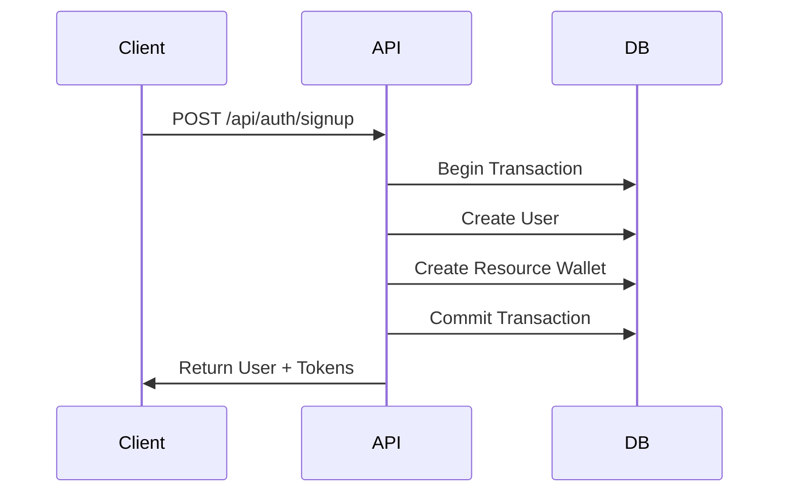
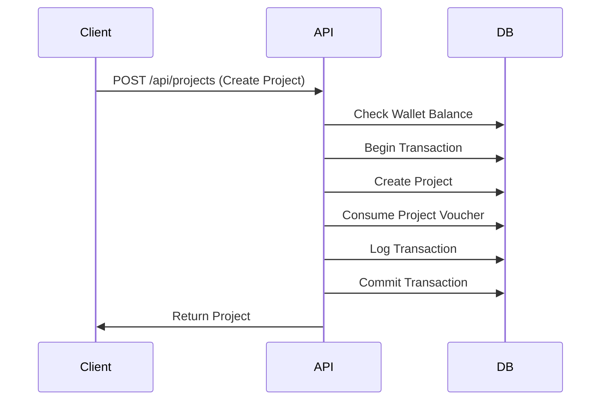

# Authentication API v1.5

## Overview

This document describes the authentication API endpoints for Saga v1.5, which includes the unified user account model with automatic resource wallet creation.

## Authentication Endpoints

### POST /api/auth/signup

Create a new user account with automatic resource wallet creation.

**Request Body:**
```json
{
  "name": "John Doe",
  "email": "john@example.com",
  "password": "SecurePassword123",
  "phone": "+1234567890" // optional
}
```

**Response (201 Created):**
```json
{
  "user": {
    "id": "user-uuid",
    "name": "John Doe",
    "email": "john@example.com",
    "created_at": "2024-01-01T00:00:00Z"
  },
  "accessToken": "jwt-access-token",
  "refreshToken": "jwt-refresh-token"
}
```

**Features:**
- Automatically creates resource wallet with default credits
- Supports OAuth provider integration
- Validates email uniqueness
- Hashes password securely

### POST /api/auth/signin

Authenticate existing user.

**Request Body:**
```json
{
  "email": "john@example.com",
  "password": "SecurePassword123"
}
```

**Response (200 OK):**
```json
{
  "user": {
    "id": "user-uuid",
    "name": "John Doe",
    "email": "john@example.com",
    "created_at": "2024-01-01T00:00:00Z"
  },
  "accessToken": "jwt-access-token",
  "refreshToken": "jwt-refresh-token"
}
```

## User Profile Endpoints

### GET /api/users/me/profile

Get current user profile with wallet information.

**Headers:**
```
Authorization: Bearer <access-token>
```

**Response (200 OK):**
```json
{
  "id": "user-uuid",
  "name": "John Doe",
  "email": "john@example.com",
  "phone": "+1234567890",
  "created_at": "2024-01-01T00:00:00Z",
  "resource_wallet": {
    "project_vouchers": 1,
    "facilitator_seats": 2,
    "storyteller_seats": 2,
    "updated_at": "2024-01-01T00:00:00Z"
  }
}
```

### GET /api/users/me/wallet

Get current user's wallet balance.

**Headers:**
```
Authorization: Bearer <access-token>
```

**Response (200 OK):**
```json
{
  "project_vouchers": 1,
  "facilitator_seats": 2,
  "storyteller_seats": 2
}
```

### GET /api/users/me/transactions

Get user's transaction history with pagination.

**Headers:**
```
Authorization: Bearer <access-token>
```

**Query Parameters:**
- `page` (optional): Page number (default: 1)
- `limit` (optional): Items per page (default: 20, max: 100)

**Response (200 OK):**
```json
{
  "transactions": [
    {
      "id": "transaction-uuid",
      "transaction_type": "consume",
      "resource_type": "project_voucher",
      "amount": -1,
      "project_id": "project-uuid",
      "created_at": "2024-01-01T00:00:00Z"
    },
    {
      "id": "transaction-uuid-2",
      "transaction_type": "purchase",
      "resource_type": "facilitator_seat",
      "amount": 2,
      "project_id": null,
      "created_at": "2024-01-01T00:00:00Z"
    }
  ],
  "pagination": {
    "page": 1,
    "limit": 20,
    "total": 5,
    "pages": 1
  }
}
```

## Error Responses

### 400 Bad Request - Insufficient Resources
```json
{
  "error": {
    "code": "INSUFFICIENT_RESOURCES",
    "message": "Insufficient project_voucher: need 1, have 0"
  },
  "timestamp": "2024-01-01T00:00:00Z",
  "path": "/api/projects"
}
```

### 404 Not Found - Wallet Not Found
```json
{
  "error": {
    "code": "WALLET_NOT_FOUND",
    "message": "Resource wallet not found for user"
  },
  "timestamp": "2024-01-01T00:00:00Z",
  "path": "/api/users/me/wallet"
}
```

### 401 Unauthorized
```json
{
  "error": {
    "code": "UNAUTHORIZED",
    "message": "Invalid or expired token"
  },
  "timestamp": "2024-01-01T00:00:00Z",
  "path": "/api/users/me/profile"
}
```

### 409 Conflict - Email Already Exists
```json
{
  "error": {
    "code": "EMAIL_ALREADY_EXISTS",
    "message": "User with this email already exists"
  },
  "timestamp": "2024-01-01T00:00:00Z",
  "path": "/api/auth/signup"
}
```

## Authentication Flow

### 1. User Registration


### 2. Resource Consumption


## Middleware Usage

### requireAuth
Validates JWT token and adds user to request object.

```typescript
router.get('/api/users/me/profile', requireAuth, userController.getProfile);
```

### requireProjectRole
Validates user has specific role in project.

```typescript
router.get('/api/projects/:id/stories', 
  requireAuth,
  requireProjectRole(['facilitator', 'storyteller']),
  storyController.getProjectStories
);
```

### includeWallet
Optionally includes wallet information in user object.

```typescript
router.get('/api/users/me/profile',
  requireAuth,
  includeWallet,
  userController.getProfile
);
```

## Rate Limiting

All authentication endpoints are rate limited:

- **Signup**: 5 requests per hour per IP
- **Signin**: 10 requests per 15 minutes per IP
- **Profile endpoints**: 100 requests per hour per user

## Security Features

- **Password hashing**: bcrypt with salt rounds
- **JWT tokens**: Secure token generation with expiration
- **Refresh token rotation**: Automatic token refresh
- **Input validation**: Comprehensive request validation
- **SQL injection protection**: Parameterized queries
- **CORS protection**: Configured allowed origins